# 논문 정리

대한민국 배경영상 캡셔닝 프로젝트에 필요한 핵심 논문들을 정리합니다.

---

## 🎯 프로젝트 목표

> **AI-Hub 베이스라인 METEOR 0.3052 → 0.40+ 달성**

이를 위해 Vision-Language Model의 최신 연구들을 분석하고 적용합니다.

---

## 📊 전체 기술 발전 흐름

### Vision-Language Model 생태계

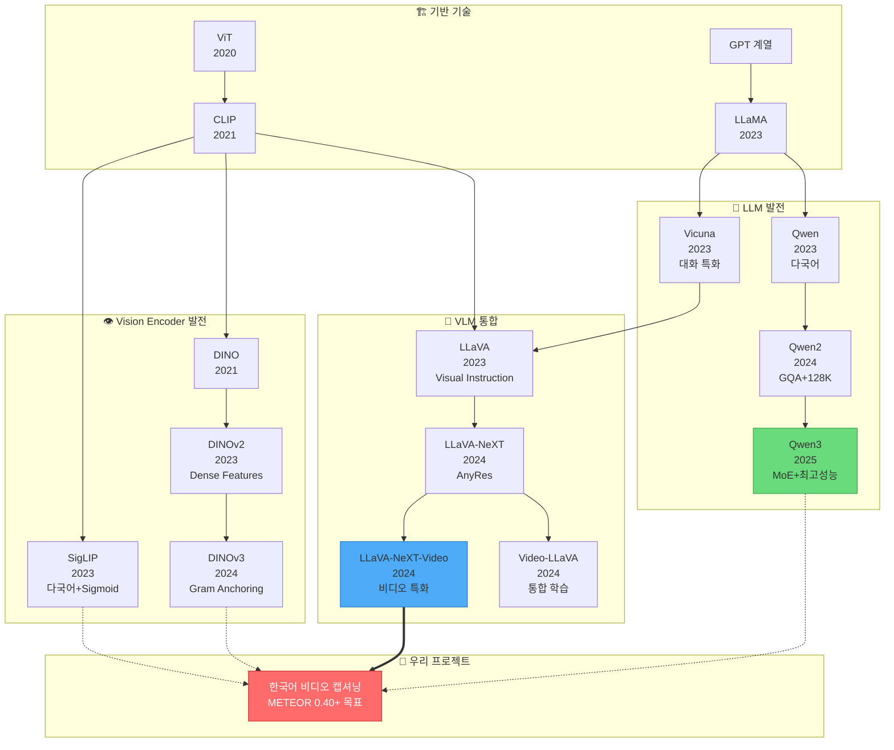

---

## 🔧 우리 프로젝트의 기술 스택

### 핵심 의존 관계

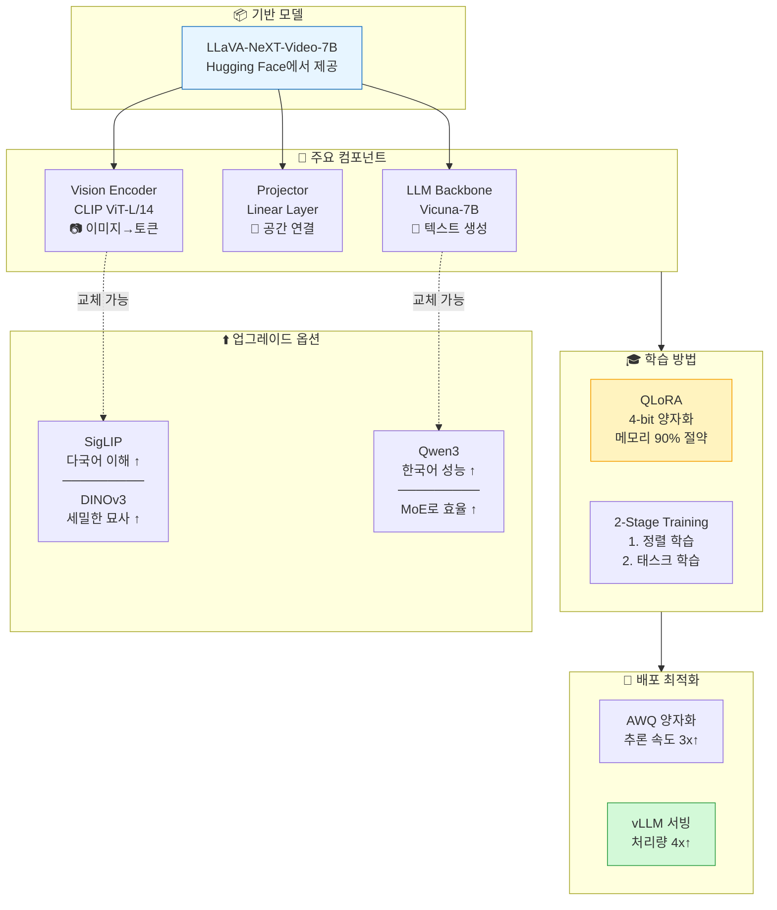

---

## 📚 카테고리별 논문 정리

### 1. [VLM Core](vlm_core/) - Vision-Language Model 핵심

> 💡 **핵심 질문**: 이미지/비디오를 어떻게 이해하고 설명할 것인가?

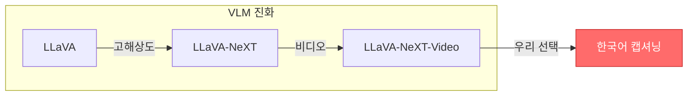

| 논문 | 연도 | 핵심 아이디어 | 우리 프로젝트 관련성 |
|------|------|--------------|-------------------|
| [LLaVA](vlm_core/llava.md) | 2023 | GPT-4로 학습 데이터 생성, 2-Stage 학습 | 학습 전략의 기초 |
| [LLaVA-NeXT](vlm_core/llava_next.md) | 2024 | AnyRes로 다양한 해상도 지원 | 고해상도 처리 방식 이해 |
| [LLaVA-NeXT-Video](vlm_core/llava_next_video.md) | 2024 | 이미지만으로 학습해도 비디오 이해 | ⭐ **우리 기본 모델** |
| [Video-LLaVA](vlm_core/video_llava.md) | 2024 | 이미지+비디오 동시 학습 | 대안 모델 |

---

### 2. [Vision Encoders](vision_encoders/) - 비전 인코더

> 💡 **핵심 질문**: 이미지에서 어떤 특징을 추출할 것인가?

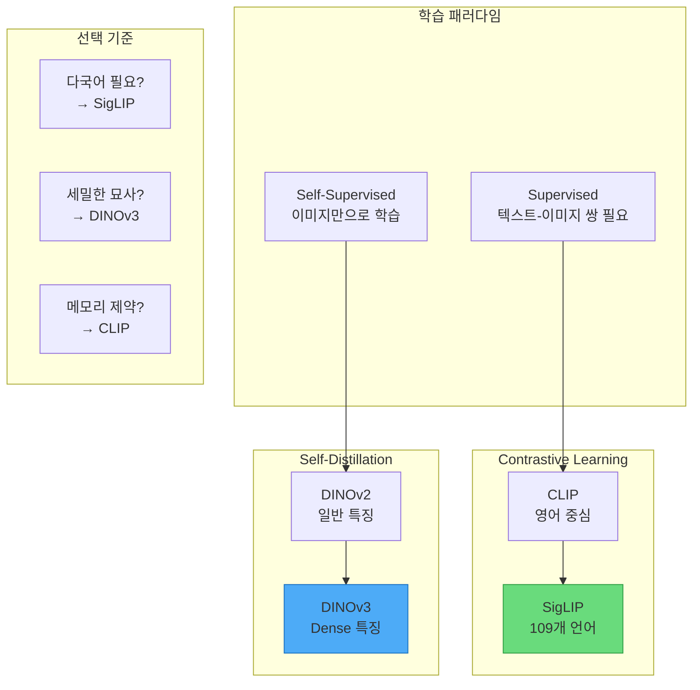

| 논문 | 연도 | 학습 방식 | 강점 | 약점 |
|------|------|----------|------|------|
| [CLIP](vision_encoders/clip.md) | 2021 | Contrastive | Zero-shot, 안정적 | 영어 편향, Dense 약함 |
| [SigLIP](vision_encoders/siglip.md) | 2023 | Sigmoid CE | 다국어, 한국어↑ | 토큰 수 증가 |
| [DINOv2](vision_encoders/dinov2.md) | 2023 | Self-distill | Dense features | 텍스트 정렬 필요 |
| [DINOv3](vision_encoders/dinov3.md) | 2024 | Gram Anchor | 최고 품질 | ⚠️ 승인 필요 |

---

### 3. [LLM Backbones](llm_backbones/) - LLM 백본

> 💡 **핵심 질문**: 어떤 언어 모델이 한국어를 잘 생성하는가?

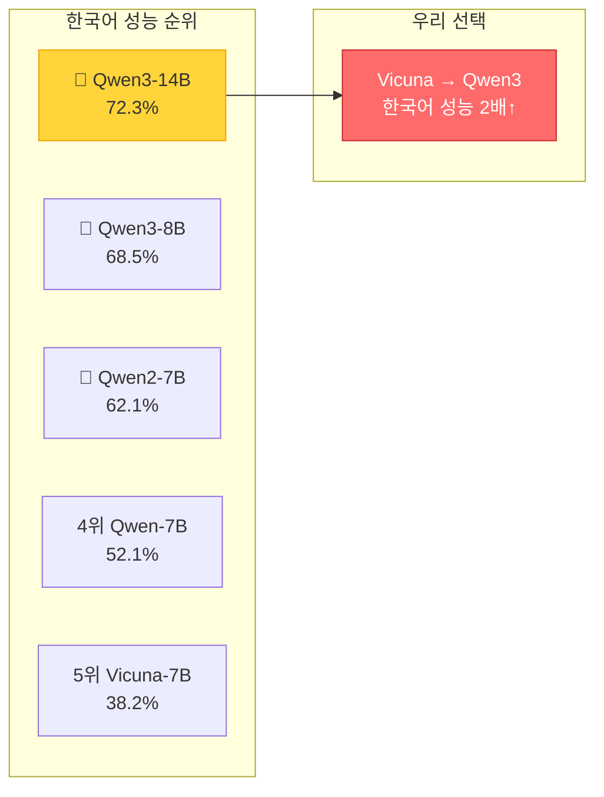

| 논문 | 연도 | 파라미터 | 한국어 MMLU | 특징 |
|------|------|----------|------------|------|
| [LLaMA](llm_backbones/llama.md) | 2023 | 7B-65B | 34.5% | 오픈소스 시작 |
| [Qwen](llm_backbones/qwen.md) | 2023 | 7B-72B | 52.1% | 다국어 특화 |
| [Qwen2](llm_backbones/qwen2.md) | 2024 | 7B-72B | 62.1% | GQA, 128K 컨텍스트 |
| [Qwen3](llm_backbones/qwen3.md) | 2025 | 0.6B-235B | **72.3%** | ⭐ MoE, 최고 성능 |

---

### 4. [Training Methods](training_methods/) - 학습 기법

> 💡 **핵심 질문**: 제한된 GPU에서 어떻게 효율적으로 학습할 것인가?

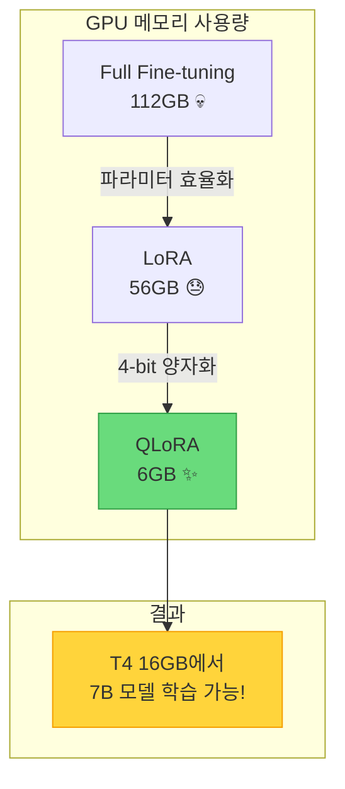

| 논문 | 연도 | 메모리 절약 | 품질 | 우리 적용 |
|------|------|-----------|------|----------|
| [LoRA](training_methods/lora.md) | 2021 | ~50% | 좋음 | A100+ |
| [QLoRA](training_methods/qlora.md) | 2023 | ~90% | 좋음 | ⭐ T4/L4 필수 |
| [DoRA](training_methods/dora.md) | 2024 | ~50% | 더 좋음 | 선택적 |
| [2-Stage](training_methods/llava_2stage.md) | 2023 | - | - | ⭐ 학습 전략 |

---

### 5. [Inference Optimization](inference_opt/) - 추론 최적화

> 💡 **핵심 질문**: 학습된 모델을 어떻게 빠르게 서빙할 것인가?

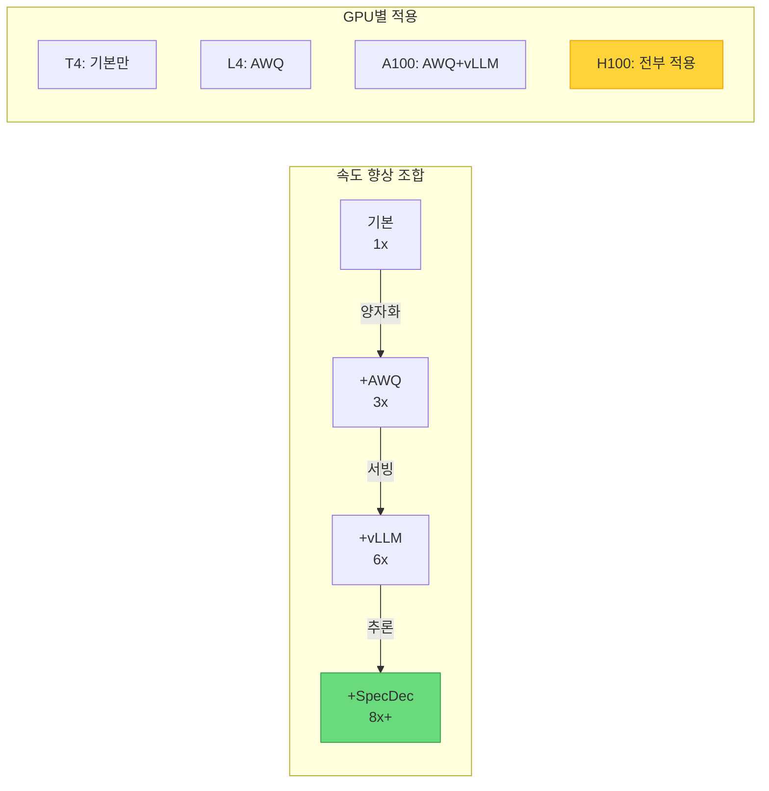

| 논문 | 연도 | 속도 향상 | 핵심 기술 | 적용 시점 |
|------|------|----------|----------|----------|
| [GPTQ](inference_opt/gptq.md) | 2022 | 2-3x | Post-training 양자화 | 배포 시 |
| [AWQ](inference_opt/awq.md) | 2023 | 3-4x | Activation-aware | ⭐ A100+ |
| [vLLM](inference_opt/vllm.md) | 2023 | 2-4x | PagedAttention | ⭐ A100+ |
| [Speculative](inference_opt/speculative_decoding.md) | 2023 | 2-3x | Draft-Verify | H100 |

---

## 🗺️ 프로젝트 로드맵

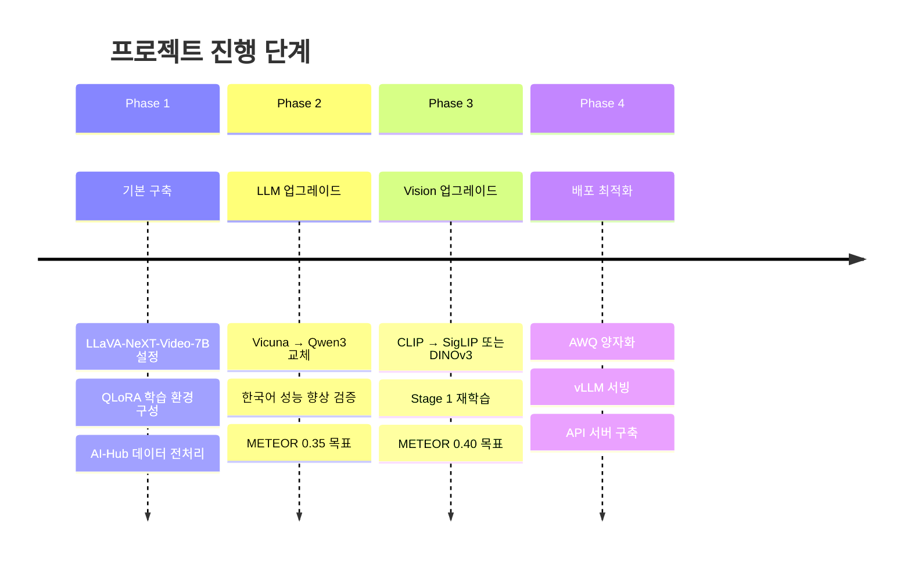

---

## 💻 GPU별 권장 구성

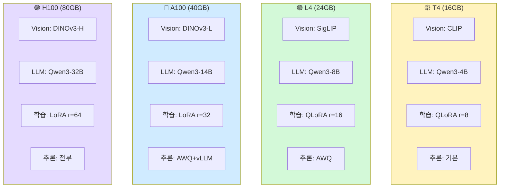

---

## 📖 추천 학습 순서

### 🌱 입문자

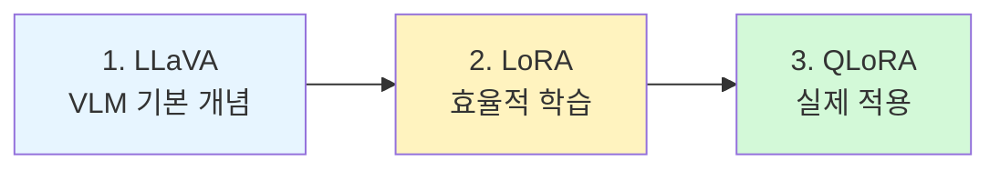

### 🌳 심화 학습

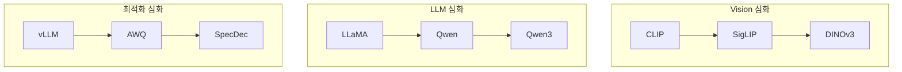

### 🎯 프로젝트 직접 관련

1. **[LLaVA-NeXT-Video](vlm_core/llava_next_video.md)** - 우리 기본 모델
2. **[Qwen3](llm_backbones/qwen3.md)** - LLM 업그레이드 대상
3. **[QLoRA](training_methods/qlora.md)** - 학습 필수 기법
4. **[2-Stage Training](training_methods/llava_2stage.md)** - 학습 전략
