# Inference Optimization - 추론 최적화

> 💡 **핵심 질문**: 학습된 모델을 어떻게 빠르고 효율적으로 서빙할 것인가?

추론 속도와 효율성을 향상시키는 기법들의 발전 흐름을 정리합니다.

---

## 🎯 이 카테고리의 목표

학습이 끝난 후, 실제 서비스에서는 **속도**와 **비용**이 중요합니다. 최적화 기법들을 조합하면 **8배 이상** 속도를 향상시킬 수 있습니다.

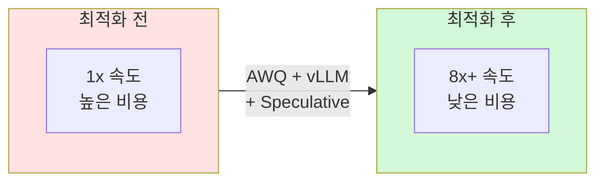

---

## 📊 속도 향상 비교

### 최적화 기법 조합 효과

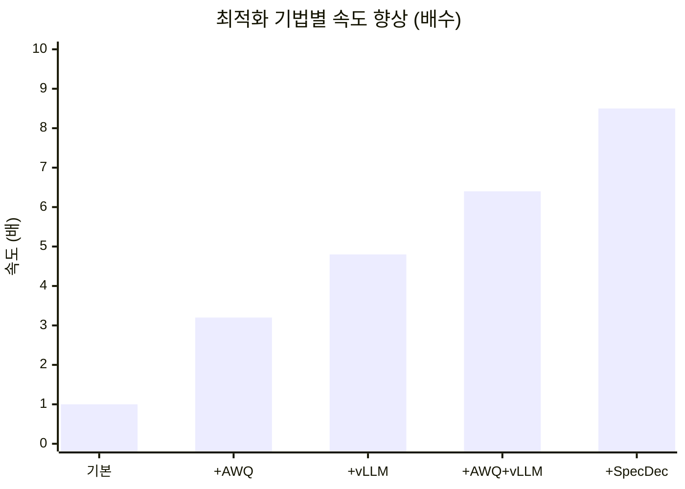

---

## 📈 최적화 기법 발전 흐름

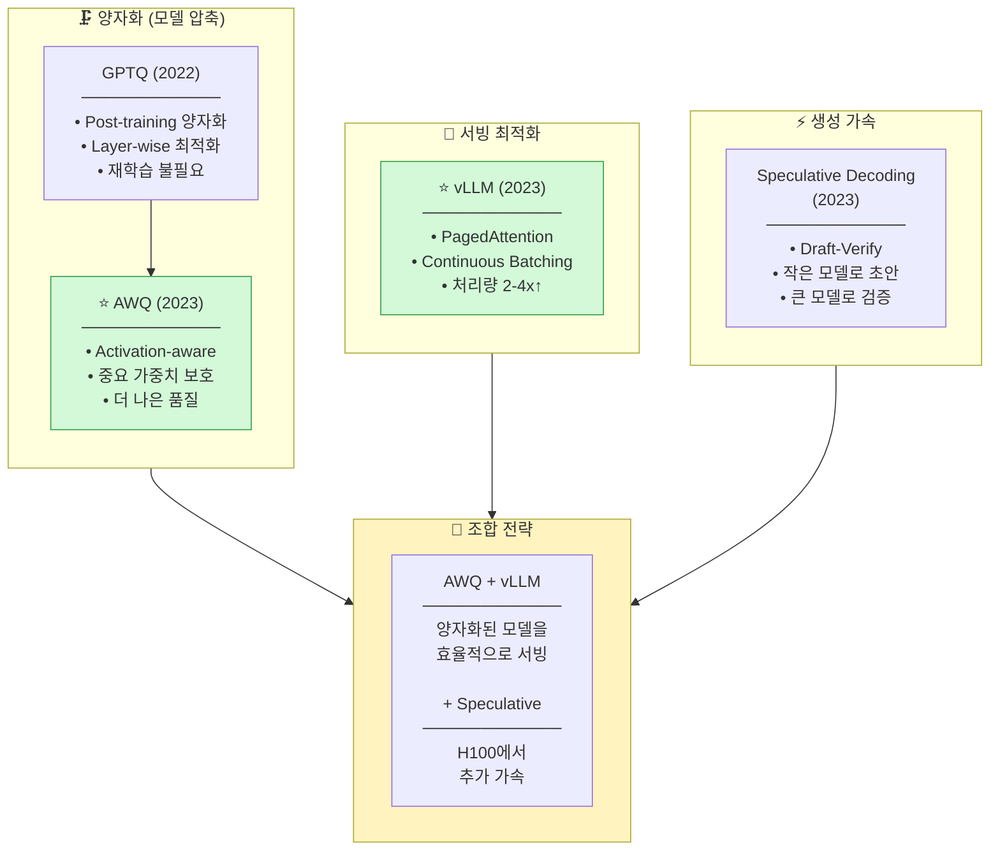

---

## 🔬 핵심 기술 상세

### 1. AWQ (Activation-aware Weight Quantization)

#### 핵심 아이디어

모든 가중치가 **똑같이 중요하지 않습니다**. Activation이 큰 채널의 가중치가 더 중요합니다!

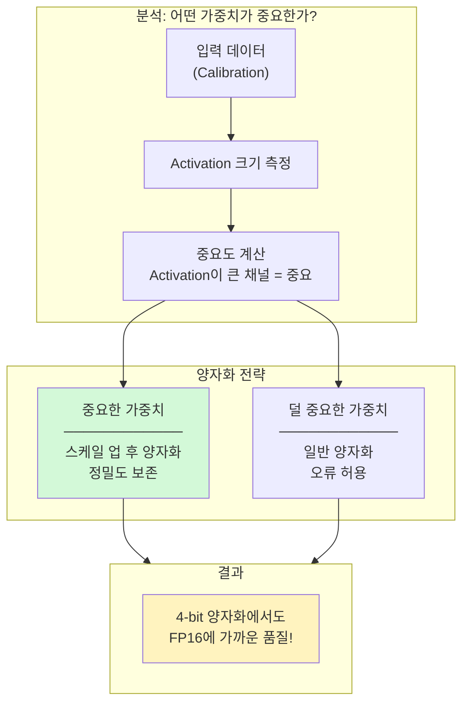

#### AWQ vs GPTQ 비교

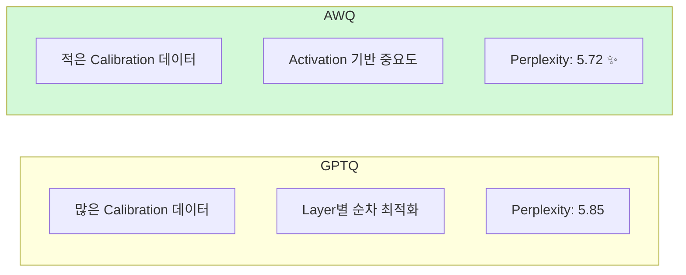

---

### 2. vLLM (PagedAttention)

#### 기존 KV Cache 문제

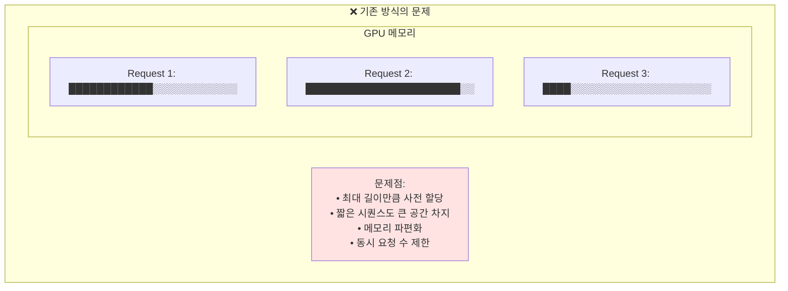

#### PagedAttention 해결책

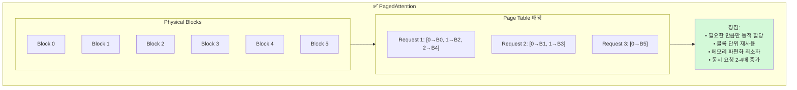

#### Continuous Batching

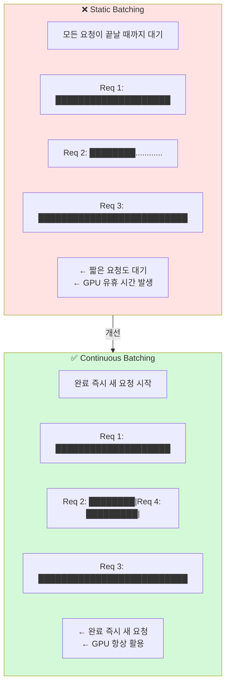

---

### 3. Speculative Decoding

#### 핵심 아이디어

큰 모델의 **토큰 생성은 느립니다**. 작은 모델로 **초안**을 만들고, 큰 모델로 **검증**하면 빠릅니다!

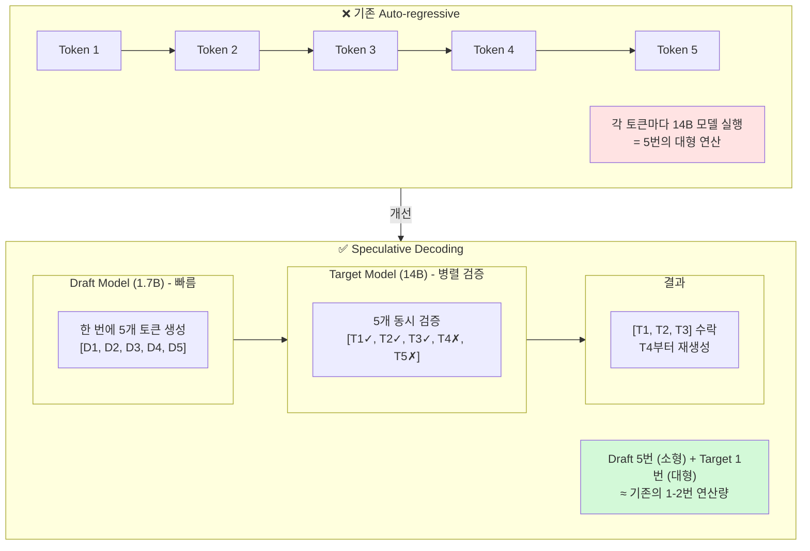

#### 수학적 분석

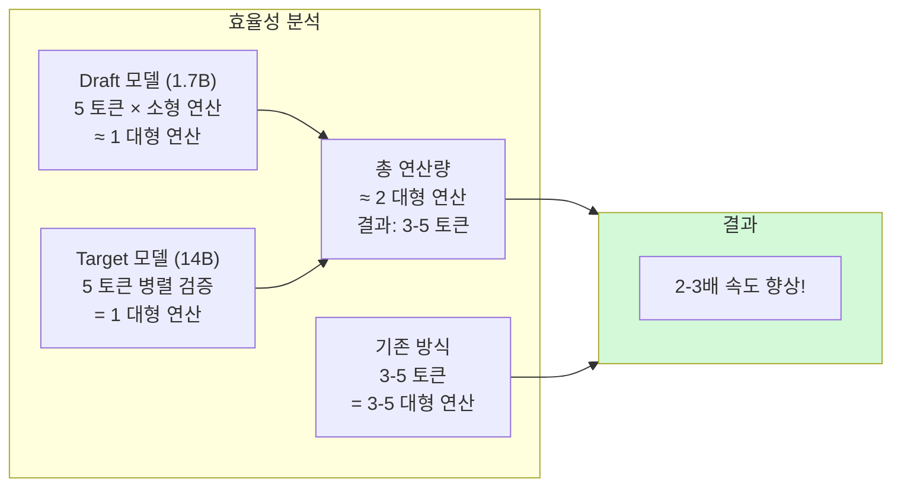

---

## 🎯 우리 프로젝트 적용

### GPU별 최적화 전략

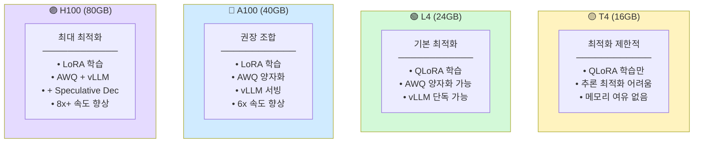

### 배포 파이프라인

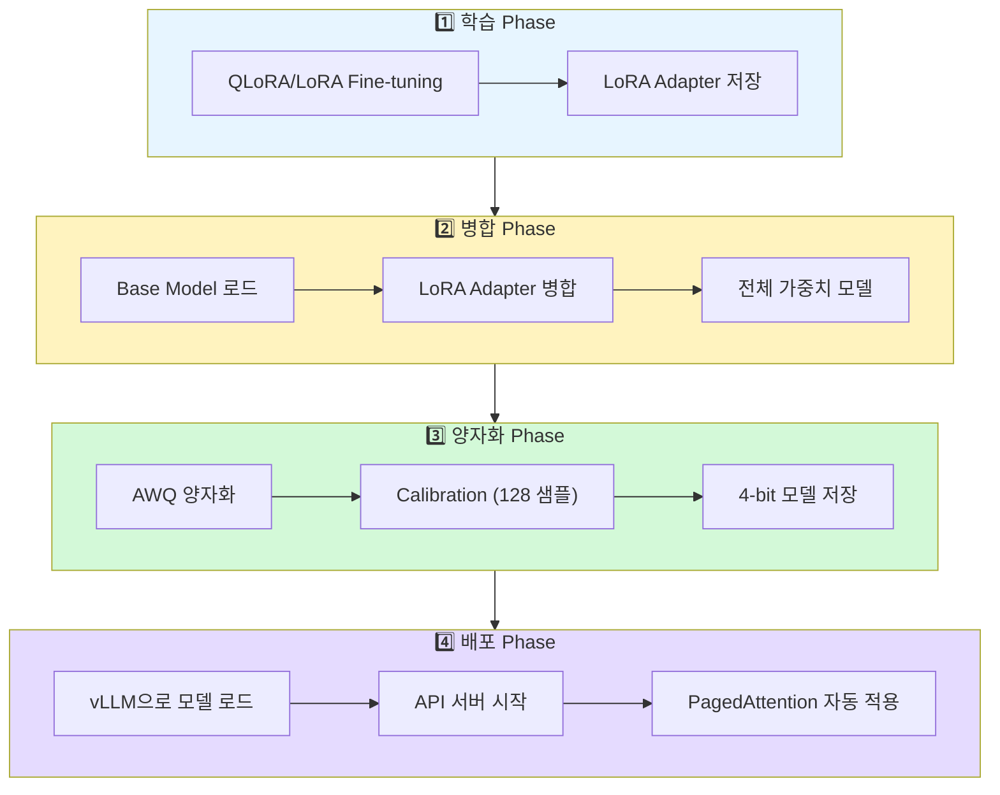

### 코드 예시

#### AWQ 양자화

```python
from awq import AutoAWQForCausalLM

# 모델 로드
model = AutoAWQForCausalLM.from_pretrained(model_path)

# AWQ 양자화
model.quantize(
    tokenizer,
    quant_config={
        "zero_point": True,
        "q_group_size": 128,
        "w_bit": 4,
    },
    calib_data=calibration_samples,  # 128개면 충분
)

# 저장
model.save_quantized("model-awq")
```

#### vLLM 서빙

```python
from vllm import LLM, SamplingParams

# AWQ 모델을 vLLM으로 로드
llm = LLM(
    model="model-awq",
    quantization="awq",
    tensor_parallel_size=1,
    gpu_memory_utilization=0.9,
)

# 샘플링 설정
sampling_params = SamplingParams(
    temperature=0.7,
    top_p=0.9,
    max_tokens=256,
)

# 배치 추론
outputs = llm.generate(prompts, sampling_params)
```

#### Speculative Decoding (H100)

```python
from vllm import LLM

llm = LLM(
    model="Qwen/Qwen3-14B-Instruct-AWQ",
    speculative_model="Qwen/Qwen3-1.7B-Instruct",  # Draft 모델
    num_speculative_tokens=5,
)
```

---

## 📚 논문 목록

| 파일 | 논문 | 핵심 포인트 | 중요도 |
|------|------|------------|--------|
| [gptq.md](gptq.md) | GPTQ (2022) | Post-training Quantization | ⭐⭐⭐ |
| [awq.md](awq.md) | AWQ (2023) | **권장 양자화** | ⭐⭐⭐⭐⭐ |
| [vllm.md](vllm.md) | vLLM (2023) | **권장 서빙 프레임워크** | ⭐⭐⭐⭐⭐ |
| [speculative_decoding.md](speculative_decoding.md) | Speculative (2023) | H100 추가 최적화 | ⭐⭐⭐⭐ |

---

## 💻 적용 우선순위

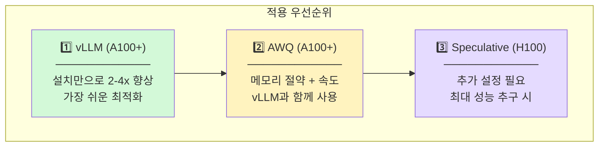
