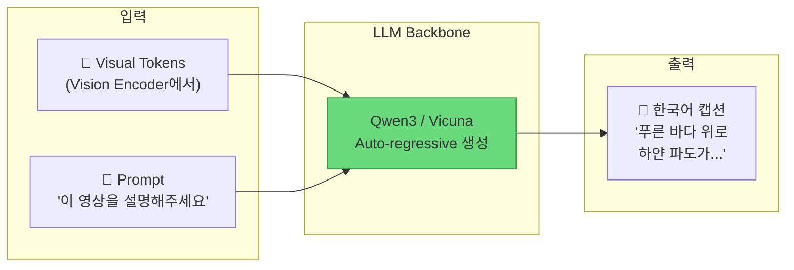
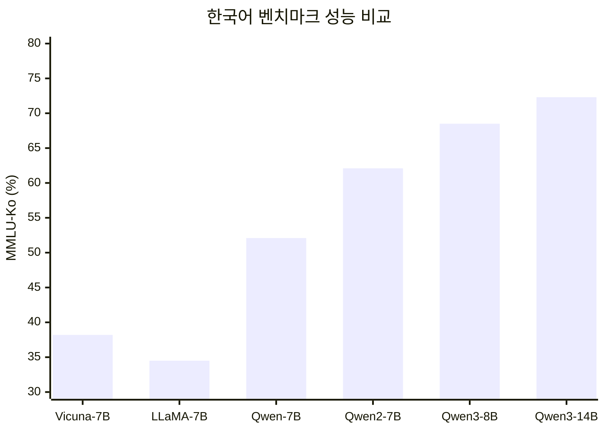
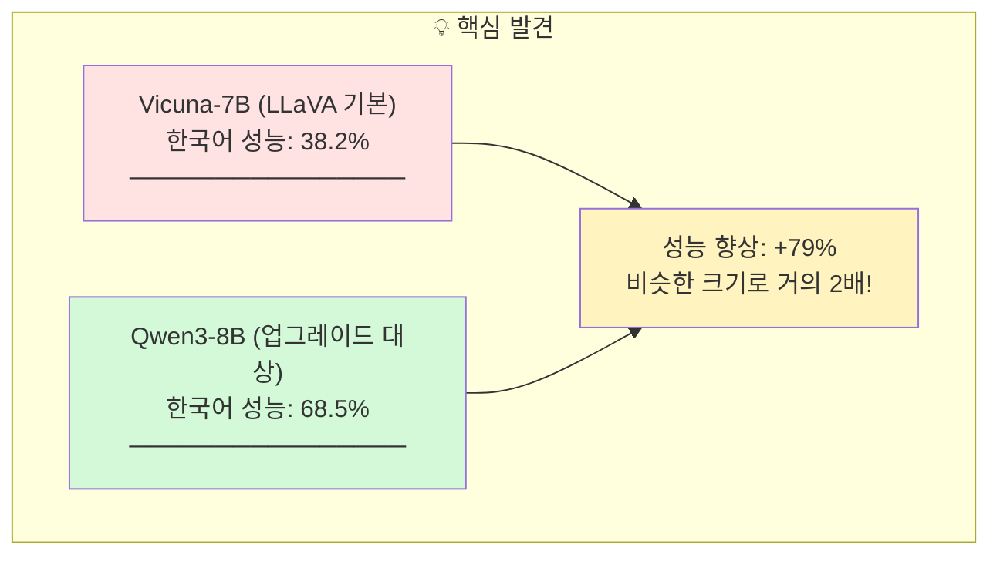
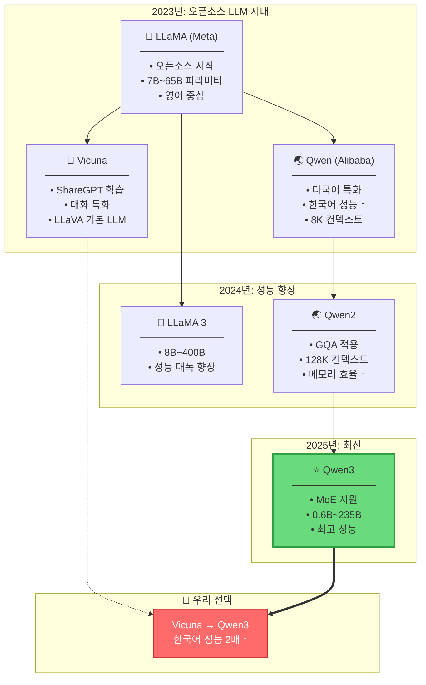
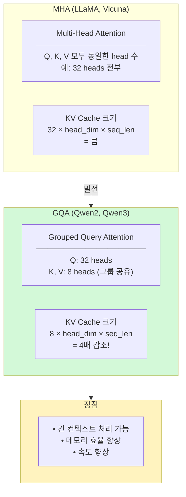
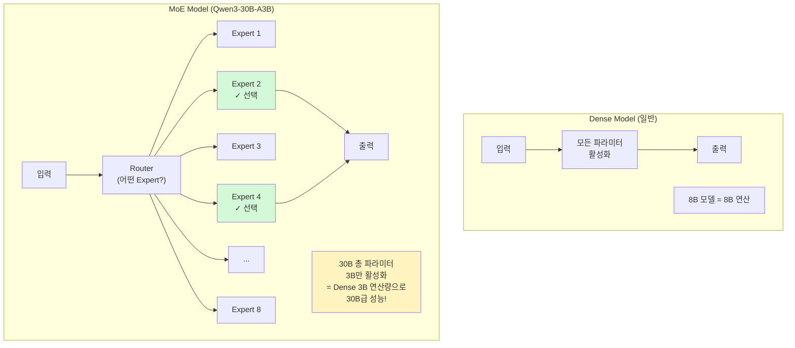
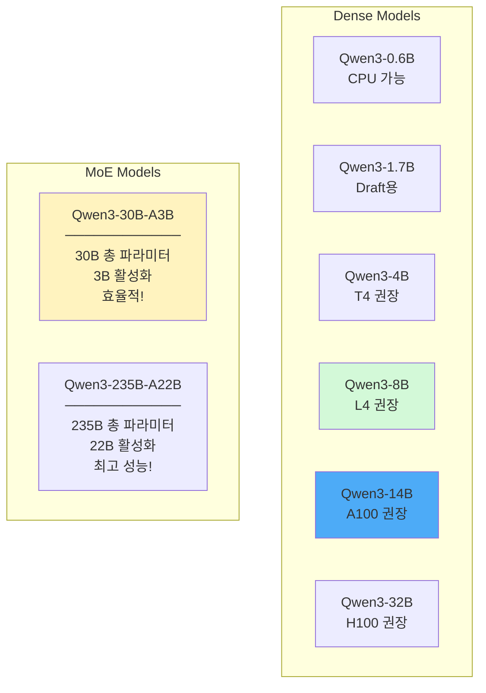
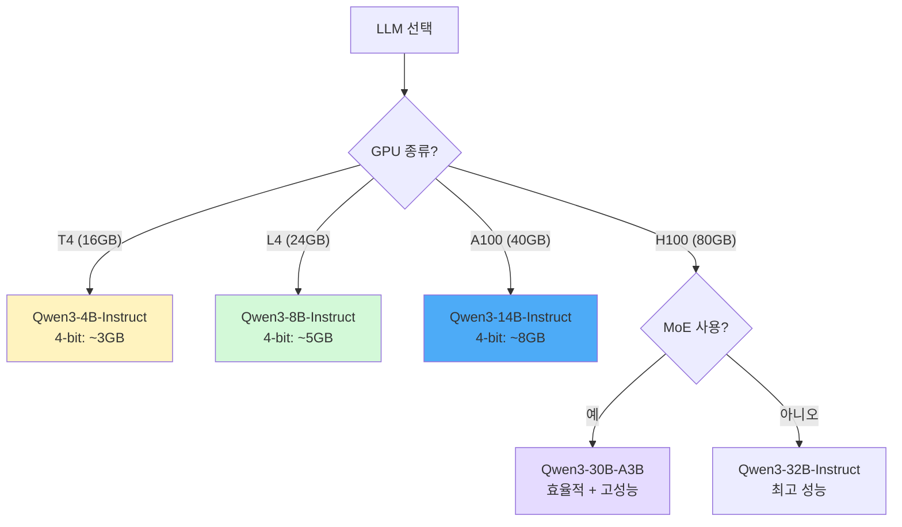
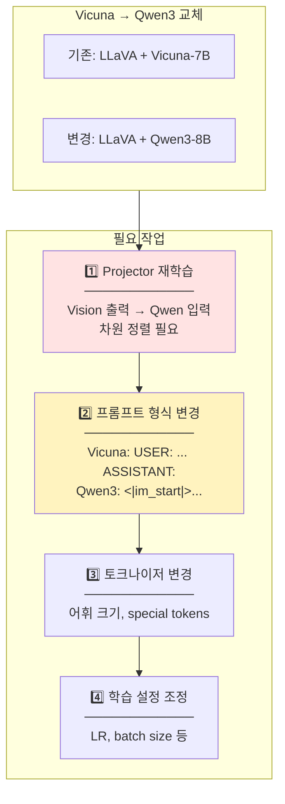

# LLM Backbones - 대규모 언어 모델

> 💡 **핵심 질문**: 어떤 언어 모델이 한국어를 가장 자연스럽게 생성하는가?

VLM에서 텍스트 생성을 담당하는 LLM Backbone의 발전 흐름을 정리합니다.

---

## 🎯 이 카테고리의 목표

LLM은 Visual Tokens을 받아 **자연스러운 한국어 캡션**을 생성합니다. 한국어 성능이 프로젝트의 핵심입니다.



---

## 📊 한국어 성능 비교

### MMLU-Ko 벤치마크 (한국어 추론 능력)



### 핵심 인사이트



---

## 📈 LLM 발전 흐름



---

## 🔬 아키텍처 상세

### Attention 메커니즘 진화



### MoE (Mixture of Experts) - Qwen3



---

## 📊 모델별 상세 비교

### Qwen3 라인업



### 상세 비교표

| 모델 | 파라미터 | 컨텍스트 | 한국어 | 라이선스 | GPU 권장 |
|------|----------|----------|--------|----------|----------|
| Vicuna-7B | 7B | 4K | 38.2% | 연구용 | T4 |
| Qwen-7B | 7B | 32K | 52.1% | 일부 상업 | T4 |
| Qwen2-7B | 7B | 128K | 62.1% | Apache-2.0 | L4 |
| **Qwen3-4B** | 4B | 32K | ~60% | Apache-2.0 | **T4** |
| **Qwen3-8B** | 8B | 128K | 68.5% | Apache-2.0 | **L4** |
| **Qwen3-14B** | 14B | 128K | 72.3% | Apache-2.0 | **A100** |
| **Qwen3-32B** | 32B | 128K | ~75% | Apache-2.0 | **H100** |

---

## 🎯 우리 프로젝트 적용

### LLM 교체 결정 트리



### LLM 교체 시 필요한 작업



### 프롬프트 형식 비교

#### Vicuna (LLaVA 기본)
```
USER: <video>이 영상을 한국어로 상세히 묘사해주세요.
ASSISTANT: 이 영상은 푸른 바다와...
```

#### Qwen3 (업그레이드)
```
<|im_start|>system
당신은 비디오 캡셔닝 전문가입니다.<|im_end|>
<|im_start|>user
<video>이 영상을 한국어로 상세히 묘사해주세요.<|im_end|>
<|im_start|>assistant
이 영상은 푸른 바다와...<|im_end|>
```

### 코드 예시

```python
from transformers import AutoModelForCausalLM, AutoTokenizer

# Qwen3 로드
model = AutoModelForCausalLM.from_pretrained(
    "Qwen/Qwen3-8B-Instruct",
    torch_dtype=torch.float16,
    device_map="auto"
)
tokenizer = AutoTokenizer.from_pretrained("Qwen/Qwen3-8B-Instruct")

# 대화 형식 적용
messages = [
    {"role": "system", "content": "당신은 비디오 캡셔닝 전문가입니다."},
    {"role": "user", "content": "이 영상을 한국어로 상세히 묘사해주세요."}
]
text = tokenizer.apply_chat_template(messages, tokenize=False)
```

---

## 📚 논문 목록

| 파일 | 논문 | 핵심 포인트 | 중요도 |
|------|------|------------|--------|
| [llama.md](llama.md) | LLaMA (2023) | 오픈소스 LLM 기초 | ⭐⭐⭐ |
| [qwen.md](qwen.md) | Qwen (2023) | 다국어 특화 시작 | ⭐⭐⭐ |
| [qwen2.md](qwen2.md) | Qwen2 (2024) | GQA, 128K 컨텍스트 | ⭐⭐⭐⭐ |
| [qwen3.md](qwen3.md) | Qwen3 (2025) | **권장 업그레이드 대상** | ⭐⭐⭐⭐⭐ |

---

## 💻 GPU별 권장

| GPU | 권장 LLM | 4-bit 메모리 | 한국어 성능 |
|-----|----------|-------------|------------|
| **T4 (16GB)** | Qwen3-4B-Instruct | ~3GB | ~60% |
| **L4 (24GB)** | Qwen3-8B-Instruct | ~5GB | 68.5% |
| **A100 (40GB)** | Qwen3-14B-Instruct | ~8GB | 72.3% |
| **H100 (80GB)** | Qwen3-32B-Instruct | ~18GB | ~75% |
