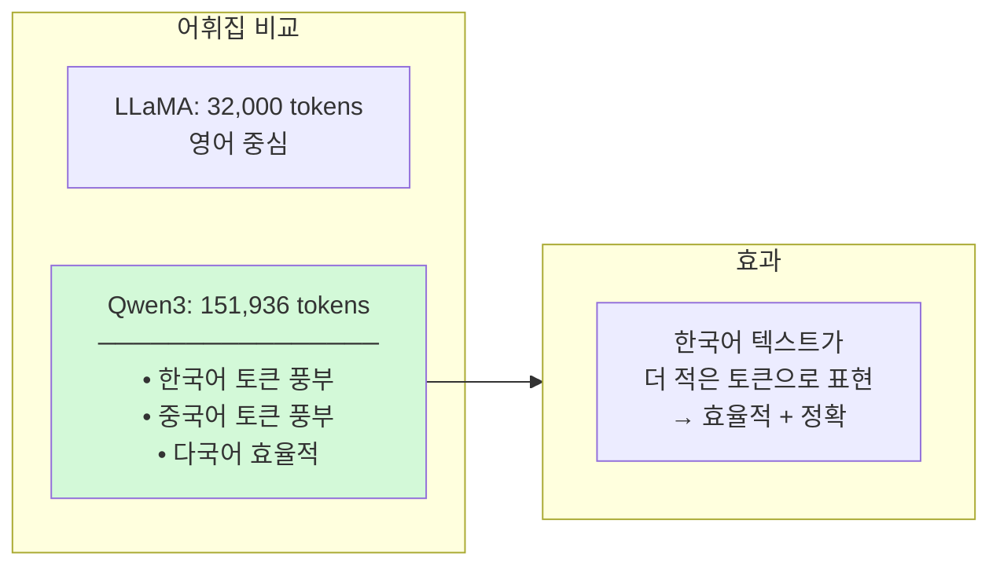
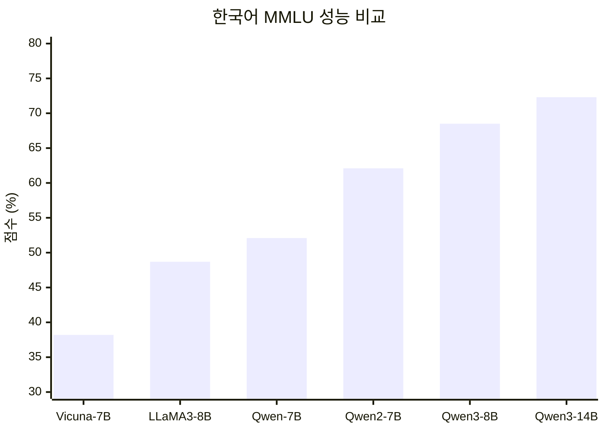
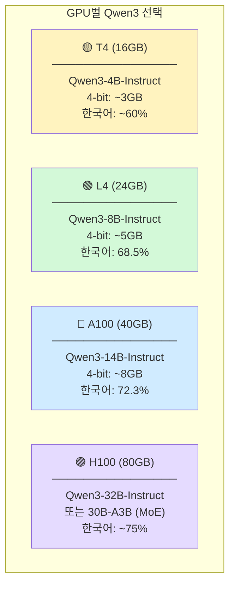
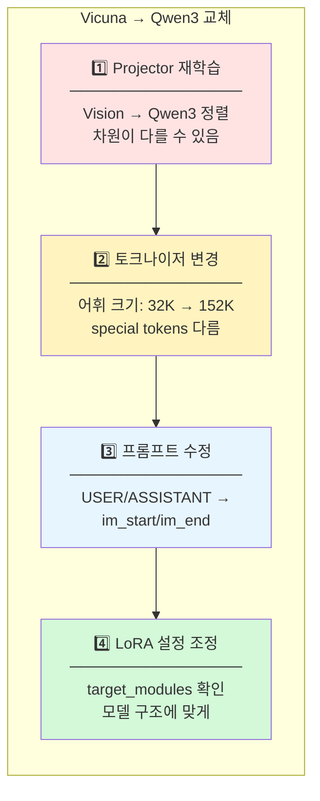
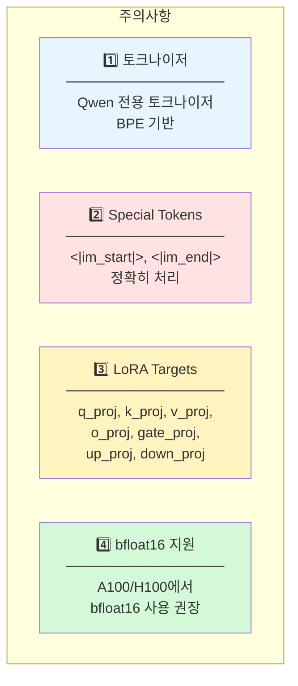

# Qwen3: A Family of Large Language Models

> ⭐ **한국어 최고 성능**: MoE 지원, 128K 컨텍스트, Apache-2.0 라이선스

- **기관**: Alibaba Cloud
- **연도**: 2025
- **링크**: [GitHub](https://github.com/QwenLM/Qwen3)

---

## 핵심 기여

1. **다양한 크기**: 0.6B ~ 235B, 모든 GPU에서 사용 가능
2. **MoE 지원**: 30B-A3B, 235B-A22B 효율적인 대형 모델
3. **128K 컨텍스트**: 긴 비디오 설명에 유리 (RoPE 확장)
4. **한국어 최고 성능**: MMLU-Ko 72.3% (Vicuna 대비 2배)
5. **Apache-2.0 라이선스**: 상업적 사용 자유

---

## 모델 라인업

### Dense Models

| 모델 | 파라미터 | 권장 GPU | 4-bit 메모리 |
|------|---------|---------|-------------|
| Qwen3-0.6B | 0.6B | CPU | ~0.4GB |
| Qwen3-1.7B | 1.7B | 모든 GPU | ~1GB |
| **Qwen3-4B** | 4B | **T4** | ~3GB |
| **Qwen3-8B** | 8B | **L4** | ~5GB |
| **Qwen3-14B** | 14B | **A100** | ~8GB |
| Qwen3-32B | 32B | H100 | ~18GB |

### MoE Models

| 모델 | 총 파라미터 | 활성 파라미터 | 특징 |
|------|-----------|-------------|------|
| Qwen3-30B-A3B | 30B | 3B (10%) | Dense 3B 연산, Dense 30B 성능 |
| Qwen3-235B-A22B | 235B | 22B | 최고 성능, 다중 GPU 필요 |

---

## 아키텍처 상세

### Decoder Layer 구조


### GQA (Grouped Query Attention)


> Qwen3는 GQA로 KV Cache를 4배 절약

| 방식 | Q Heads | KV Heads | KV Cache |
|------|---------|----------|----------|
| MHA | 32 | 32 | 32 × dim |
| **GQA** | 32 | 8 | **8 × dim (4배 감소)** |

### MoE (Mixture of Experts)


> Qwen3-30B-A3B: 총 30B 파라미터 중 3B만 활성화

### 어휘집 (Vocabulary)



---

## 📊 한국어 성능 비교



### 상세 비교표

| 모델 | 파라미터 | 컨텍스트 | 한국어 MMLU | 특징 |
|------|----------|----------|------------|------|
| Vicuna-7B | 7B | 4K | 38.2% | LLaVA 기본 |
| Qwen-7B | 7B | 32K | 52.1% | 1세대 |
| Qwen2-7B | 7B | 128K | 62.1% | GQA 도입 |
| **Qwen3-8B** | 8B | 128K | **68.5%** | ⭐ L4 권장 |
| **Qwen3-14B** | 14B | 128K | **72.3%** | ⭐ A100 권장 |

---

## 🎯 우리 프로젝트 적용

### GPU별 권장 모델



### 프롬프트 형식

```python
# Qwen3 Chat Template
messages = [
    {"role": "system", "content": "당신은 비디오 캡셔닝 전문가입니다."},
    {"role": "user", "content": "<video>이 영상을 한국어로 상세히 묘사해주세요."}
]

# apply_chat_template 사용
text = tokenizer.apply_chat_template(messages, tokenize=False)

# 결과:
# <|im_start|>system
# 당신은 비디오 캡셔닝 전문가입니다.<|im_end|>
# <|im_start|>user
# <video>이 영상을 한국어로 상세히 묘사해주세요.<|im_end|>
# <|im_start|>assistant
```

### LLM 교체 시 필요 작업



### 코드 예시

```python
from transformers import AutoModelForCausalLM, AutoTokenizer, BitsAndBytesConfig

# 4-bit 양자화 설정
bnb_config = BitsAndBytesConfig(
    load_in_4bit=True,
    bnb_4bit_compute_dtype=torch.float16,
    bnb_4bit_quant_type="nf4",
    bnb_4bit_use_double_quant=True,
)

# 모델 로드
model = AutoModelForCausalLM.from_pretrained(
    "Qwen/Qwen3-8B-Instruct",
    quantization_config=bnb_config,
    device_map="auto",
)
tokenizer = AutoTokenizer.from_pretrained("Qwen/Qwen3-8B-Instruct")

# 대화 형식 적용
messages = [
    {"role": "system", "content": "당신은 비디오 캡셔닝 전문가입니다."},
    {"role": "user", "content": "한국의 전통 건축물에 대해 설명해주세요."}
]
text = tokenizer.apply_chat_template(messages, tokenize=False, add_generation_prompt=True)

# 생성
inputs = tokenizer(text, return_tensors="pt").to(model.device)
outputs = model.generate(**inputs, max_new_tokens=256)
response = tokenizer.decode(outputs[0], skip_special_tokens=True)
```

---

## ⚠️ 구현 시 주의점



---

## 🔗 관련 리소스

- **Hugging Face**:
  - `Qwen/Qwen3-4B-Instruct`
  - `Qwen/Qwen3-8B-Instruct`
  - `Qwen/Qwen3-14B-Instruct`
  - `Qwen/Qwen3-32B-Instruct`
  - `Qwen/Qwen3-30B-A3B` (MoE)
- **GitHub**: [QwenLM/Qwen3](https://github.com/QwenLM/Qwen3)
- **라이선스**: Apache-2.0 (상업적 사용 자유)

---

## 📚 인용

```bibtex
@misc{qwen3,
  title={Qwen3 Technical Report},
  author={Alibaba Cloud},
  year={2025},
  howpublished={\url{https://github.com/QwenLM/Qwen3}}
}
```
