# Training Methods - 학습 기법

> 💡 **핵심 질문**: 제한된 GPU 메모리에서 어떻게 대형 모델을 효율적으로 학습할 것인가?

효율적인 파인튜닝과 학습 전략의 발전 흐름을 정리합니다.

---

## 🎯 이 카테고리의 목표

7B 파라미터 모델을 Full Fine-tuning 하려면 **112GB GPU 메모리**가 필요합니다. 하지만 우리는 **T4 (16GB)**에서도 학습해야 합니다!

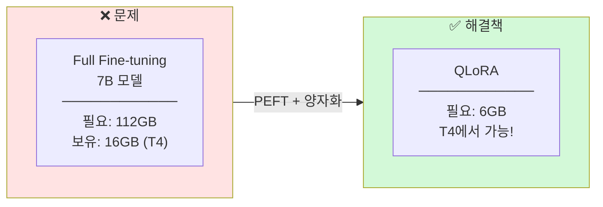

---

## 📊 메모리 사용량 비교

### 7B 모델 기준

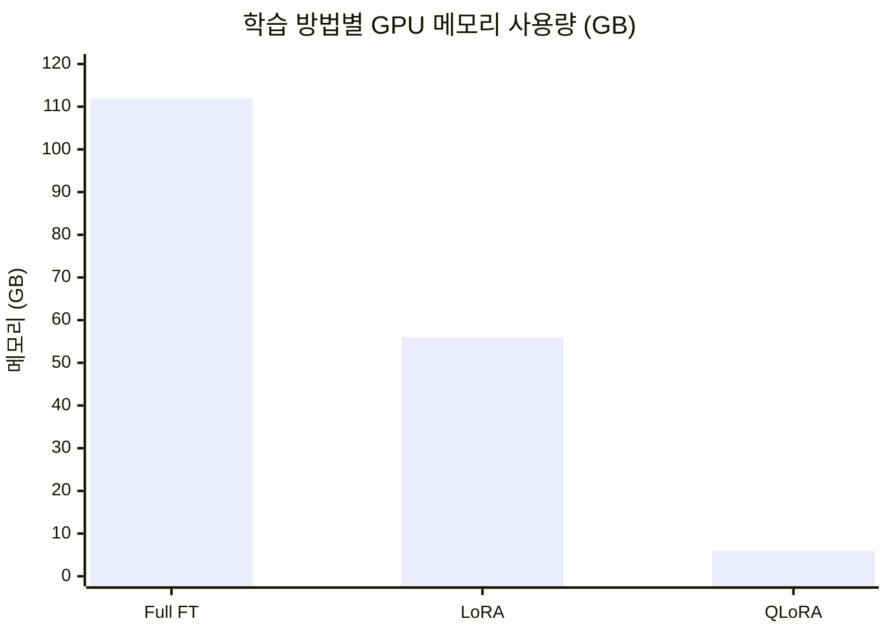

### 왜 이렇게 차이가 나는가?

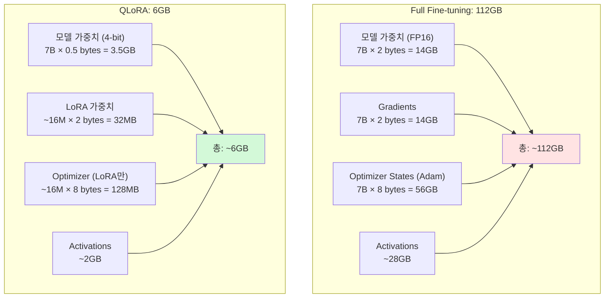

---

## 📈 PEFT 발전 흐름

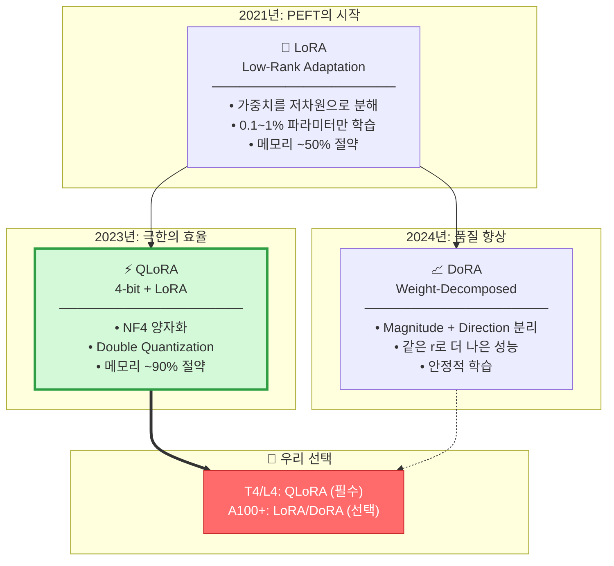

---

## 🔬 LoRA 상세 설명

### 핵심 아이디어

일반적인 가중치 업데이트는 **전체 행렬**을 수정합니다. LoRA는 이를 **저차원 행렬의 곱**으로 근사합니다.

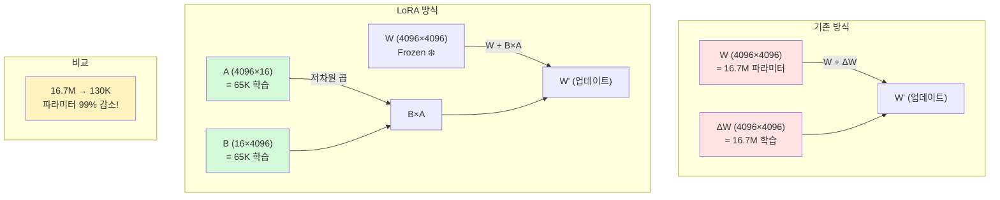

### 수학적 표현

```
원본:      h = W × x
LoRA:     h = W × x + (B × A) × x × (α/r)

여기서:
• W: 원본 가중치 (frozen)
• A: 4096 × r 행렬 (학습) - Down-projection
• B: r × 4096 행렬 (학습) - Up-projection
• r: rank (보통 8~64)
• α: scaling factor (보통 2×r)
```

### Rank 선택 가이드

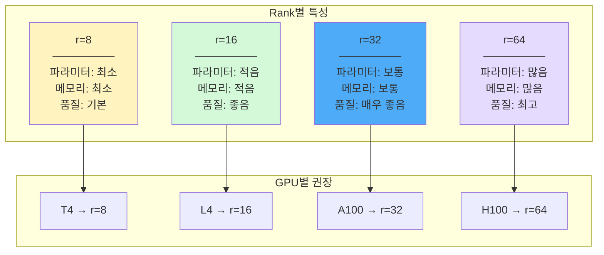

---

## ⚡ QLoRA 상세 설명

### NF4 (NormalFloat 4-bit)

일반적인 INT4는 **균일한 간격**으로 양자화합니다. 하지만 실제 가중치는 **정규분포**를 따릅니다!

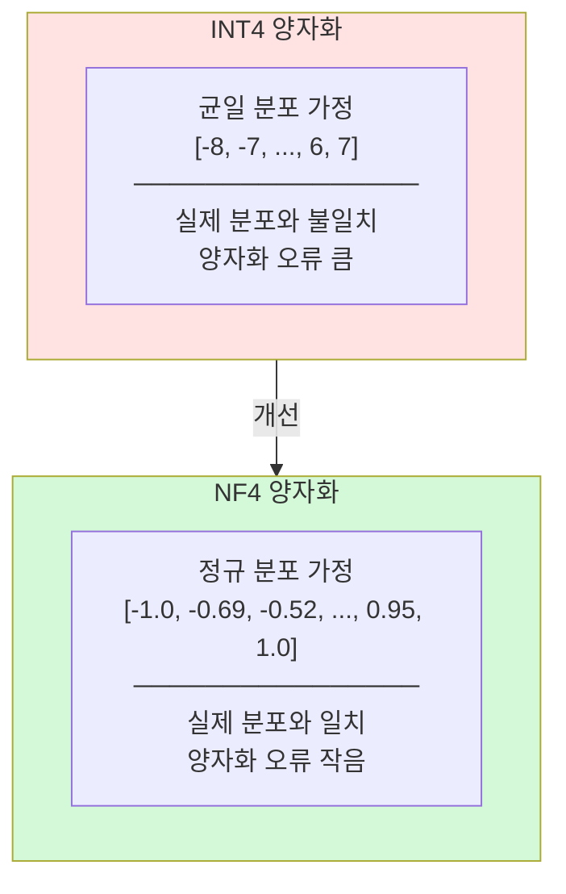

### Double Quantization

Scale 값도 양자화하여 메모리를 추가로 절약합니다.

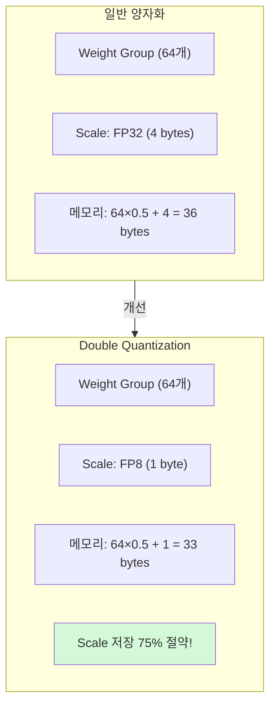

### QLoRA 전체 구조

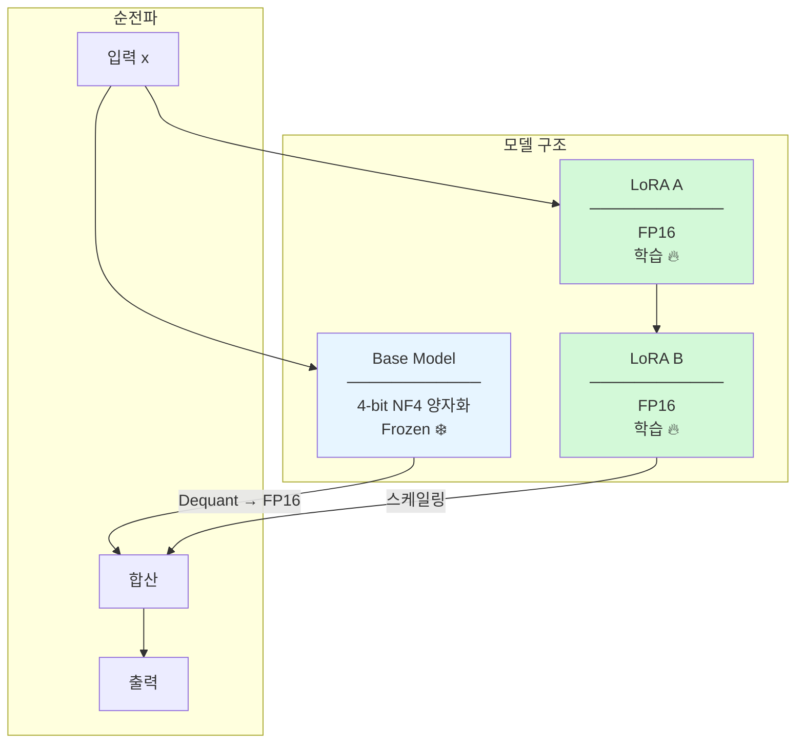

---

## 📐 2-Stage Training

LLaVA에서 제안한 멀티모달 학습 전략입니다.

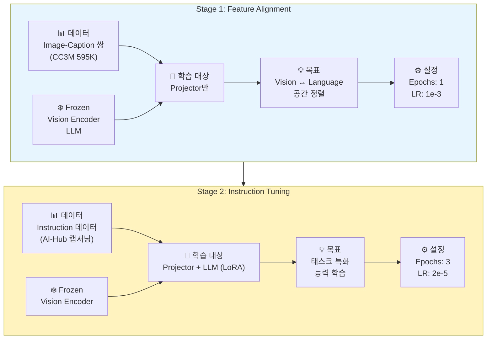

### 왜 2단계로 나누는가?

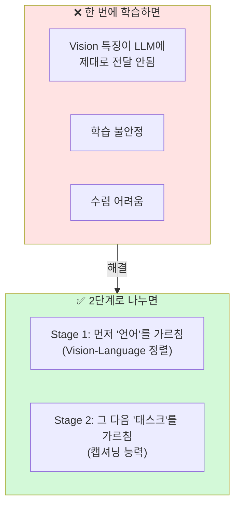

---

## 🎯 우리 프로젝트 적용

### GPU별 설정

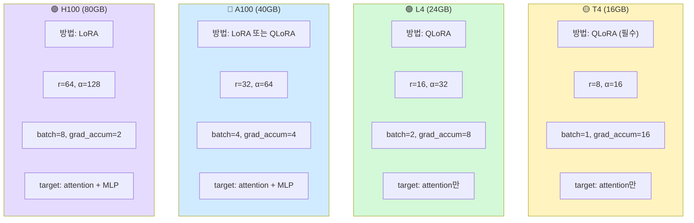

### 코드 예시

```python
from transformers import BitsAndBytesConfig
from peft import LoraConfig, get_peft_model, prepare_model_for_kbit_training

# 1. 4-bit 양자화 설정
bnb_config = BitsAndBytesConfig(
    load_in_4bit=True,
    bnb_4bit_compute_dtype=torch.float16,
    bnb_4bit_quant_type="nf4",           # NF4 사용
    bnb_4bit_use_double_quant=True,      # Double Quantization
)

# 2. 모델 로드
model = AutoModelForCausalLM.from_pretrained(
    model_id,
    quantization_config=bnb_config,
    device_map="auto",
)

# 3. LoRA 준비
model = prepare_model_for_kbit_training(model)

# 4. LoRA 설정
lora_config = LoraConfig(
    r=16,                                 # Rank
    lora_alpha=32,                        # Scaling
    target_modules=["q_proj", "k_proj", "v_proj", "o_proj"],
    lora_dropout=0.05,
    bias="none",
    task_type="CAUSAL_LM",
)

# 5. LoRA 적용
model = get_peft_model(model, lora_config)
model.print_trainable_parameters()
# 출력: trainable params: 16,777,216 || all params: 7,000,000,000 || trainable%: 0.24%
```

---

## 📚 논문 목록

| 파일 | 논문 | 핵심 포인트 | 중요도 |
|------|------|------------|--------|
| [lora.md](lora.md) | LoRA (2021) | PEFT의 기초 | ⭐⭐⭐⭐ |
| [qlora.md](qlora.md) | QLoRA (2023) | **T4/L4 필수** | ⭐⭐⭐⭐⭐ |
| [dora.md](dora.md) | DoRA (2024) | LoRA 개선 | ⭐⭐⭐ |
| [llava_2stage.md](llava_2stage.md) | 2-Stage (2023) | **멀티모달 학습 전략** | ⭐⭐⭐⭐⭐ |
