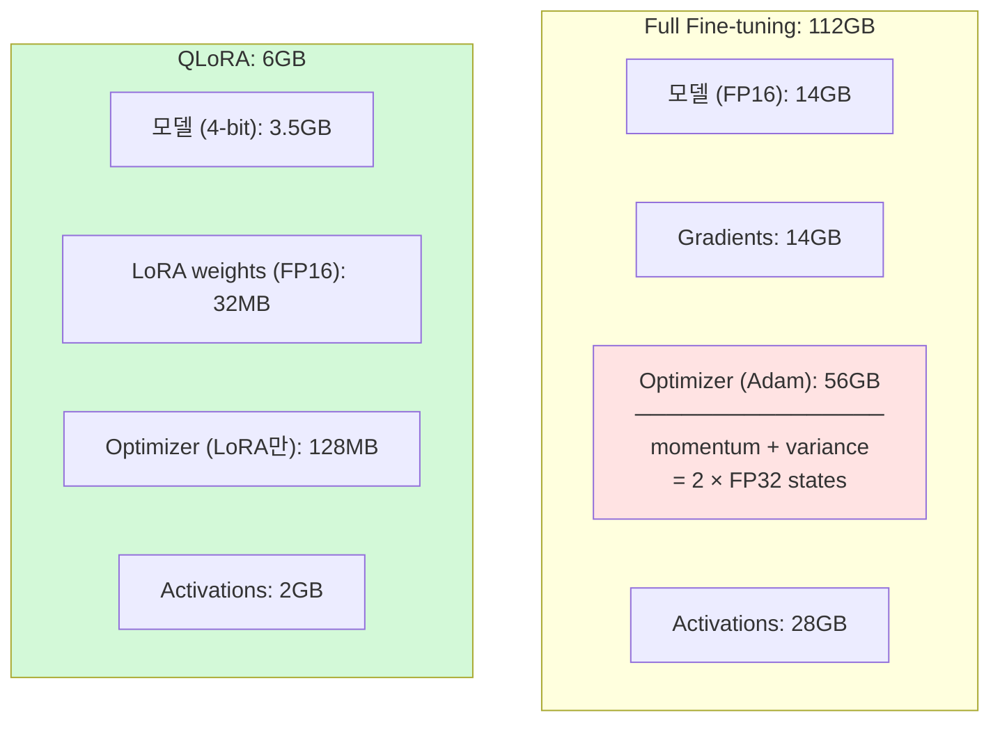
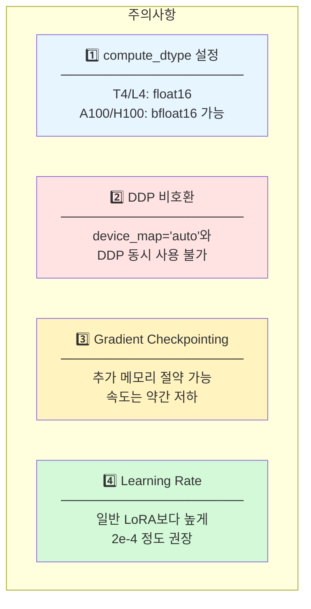

# QLoRA: Efficient Finetuning of Quantized LLMs

> ⭐ **T4/L4에서 필수**: 4-bit 양자화 + LoRA로 7B 모델을 6GB에서 학습

- **저자**: Tim Dettmers, Artidoro Pagnoni, Ari Holtzman, Luke Zettlemoyer
- **기관**: University of Washington
- **연도**: 2023
- **링크**: [arXiv:2305.14314](https://arxiv.org/abs/2305.14314)

---

## 핵심 기여

1. **NF4 (NormalFloat 4-bit)**: 정규분포 기반 양자화로 품질 손실 최소화
2. **Double Quantization**: 양자화 상수도 양자화하여 메모리 추가 절약
3. **Paged Optimizers**: GPU OOM 시 자동 스왑으로 안정적 학습
4. **극적인 메모리 절약**: 112GB → 6GB (95% 절약!)

---

## 메모리 비교


### 메모리 구성 요소 상세



---

## NF4 (NormalFloat 4-bit)

### 왜 NF4인가?

| 방식 | 분포 가정 | 특징 |
|------|----------|------|
| INT4 | 균일 분포 | 16개 균등 간격 값 |
| **NF4** | **정규 분포** | 0 근처에 더 촘촘한 값 → 실제 가중치 분포와 일치 |

### Double Quantization

- **일반 양자화**: Weight block (64개) + Scale FP32 (4B) = 36 bytes
- **Double Quantization**: Weight block (64개) + Scale FP8 (1B) = 33 bytes
- **절약**: 7B 모델 기준 약 328MB (0.3GB)

---

## QLoRA 전체 구조


**QLoRA = 4-bit Base Model (Frozen) + FP16 LoRA Adapters (Trainable)**

- **순전파**: Dequant(4-bit → FP16) + LoRA 출력 합산
- **역전파**: Gradient는 LoRA만, Base model은 frozen

---

## 우리 프로젝트 적용

### 필수 설정 (T4/L4)

```python
from transformers import BitsAndBytesConfig

bnb_config = BitsAndBytesConfig(
    load_in_4bit=True,                    # 4-bit 양자화 활성화
    bnb_4bit_compute_dtype=torch.float16, # 연산은 FP16
    bnb_4bit_quant_type="nf4",            # NF4 사용 (핵심!)
    bnb_4bit_use_double_quant=True,       # Double Quantization
)
```

### GPU별 설정

| GPU | 방식 | r | alpha | batch | target |
|-----|------|---|-------|-------|--------|
| T4 (16GB) | QLoRA 필수 | 8 | 16 | 1 | attention |
| L4 (24GB) | QLoRA 권장 | 16 | 32 | 2 | attention |
| A100 (40GB) | QLoRA/LoRA | 32 | 64 | 4 | attn+MLP |
| H100 (80GB) | LoRA 가능 | 64 | 128 | 8 | 전체 |

### 전체 코드 예시

```python
from transformers import (
    AutoModelForCausalLM,
    BitsAndBytesConfig,
)
from peft import (
    LoraConfig,
    get_peft_model,
    prepare_model_for_kbit_training,
)

# 1. 4-bit 양자화 설정
bnb_config = BitsAndBytesConfig(
    load_in_4bit=True,
    bnb_4bit_compute_dtype=torch.float16,
    bnb_4bit_quant_type="nf4",
    bnb_4bit_use_double_quant=True,
)

# 2. 모델 로드 (4-bit)
model = AutoModelForCausalLM.from_pretrained(
    model_id,
    quantization_config=bnb_config,
    device_map="auto",
)

# 3. k-bit 학습 준비
model = prepare_model_for_kbit_training(model)

# 4. LoRA 설정
lora_config = LoraConfig(
    r=16,
    lora_alpha=32,
    target_modules=["q_proj", "k_proj", "v_proj", "o_proj"],
    lora_dropout=0.05,
    bias="none",
    task_type="CAUSAL_LM",
)

# 5. PEFT 모델 생성
model = get_peft_model(model, lora_config)

# 학습 가능 파라미터 확인
model.print_trainable_parameters()
# 출력 예: trainable params: 16,777,216 || all params: 7,000,000,000 || trainable%: 0.24%
```

---

## ⚠️ 구현 시 주의점



---

## 📈 성능 (Guanaco 벤치마크)

| Model | Method | Params | Memory | MMLU | HellaSwag |
|-------|--------|--------|--------|------|-----------|
| LLaMA-7B | Full FT | 7B | 112GB | 35.1 | 76.2 |
| LLaMA-7B | LoRA | 16M | 56GB | 36.2 | 77.1 |
| LLaMA-7B | **QLoRA** | 16M | **6GB** | **36.5** | **77.3** |

> 💡 4-bit 양자화에도 성능 저하 거의 없음!

---

## 🔗 관련 리소스

- **bitsandbytes**: `pip install bitsandbytes`
- **PEFT**: `pip install peft`
- **GitHub**: [artidoro/qlora](https://github.com/artidoro/qlora)
- **Paper**: [arXiv:2305.14314](https://arxiv.org/abs/2305.14314)

---

## 📚 인용

```bibtex
@inproceedings{dettmers2023qlora,
  title={QLoRA: Efficient Finetuning of Quantized LLMs},
  author={Dettmers, Tim and Pagnoni, Artidoro and Holtzman, Ari and Zettlemoyer, Luke},
  booktitle={NeurIPS},
  year={2023}
}
```
