# Vision Encoders - 비전 인코더

> 💡 **핵심 질문**: 이미지에서 어떤 특징을 추출해야 언어 모델이 잘 이해할 수 있는가?

이미지/비디오에서 시각적 특징을 추출하는 Vision Encoder의 발전 흐름을 정리합니다.

---

## 🎯 이 카테고리의 목표

Vision Encoder는 **픽셀 데이터**를 **의미 있는 벡터**로 변환합니다. 이 벡터가 LLM에 전달되어 텍스트 생성의 기반이 됩니다.

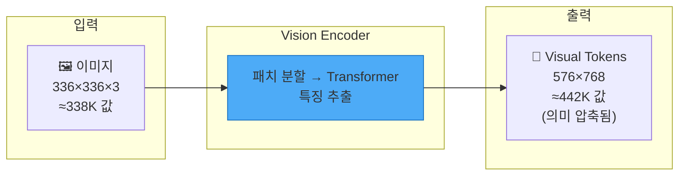

---

## 📊 발전 흐름

### 두 가지 학습 패러다임

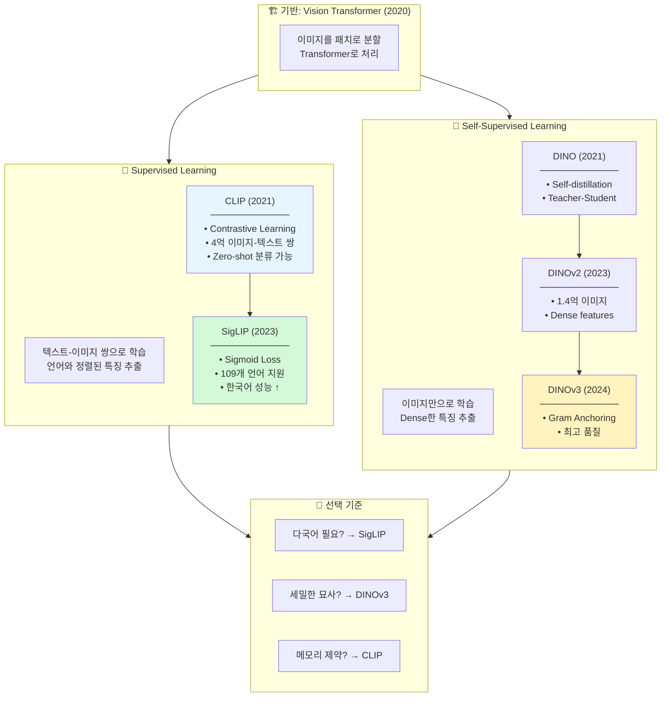

---

## 🔬 학습 방식 상세 비교

### Contrastive Learning (CLIP, SigLIP)

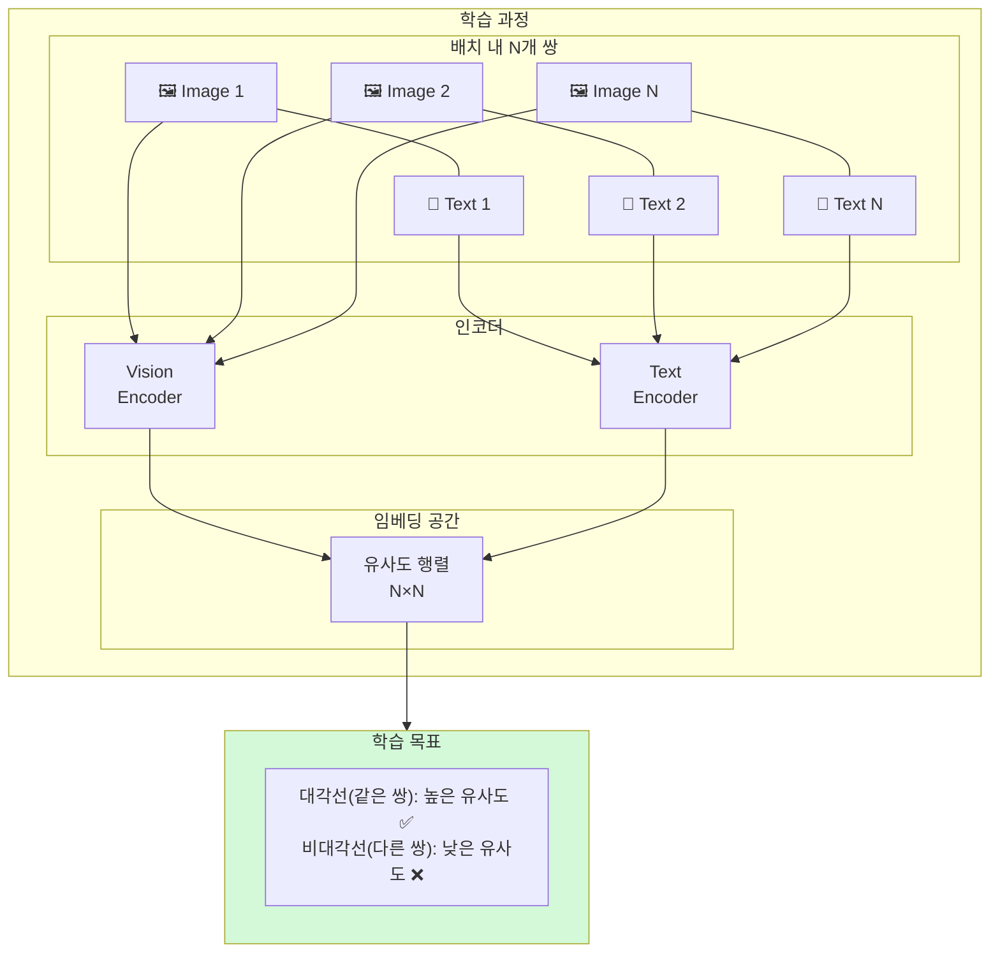

**장점:**
- ✅ Zero-shot 분류 가능 (텍스트로 카테고리 지정)
- ✅ 언어와 정렬된 특징 (VLM에서 바로 사용)
- ✅ 검증된 성능

**단점:**
- ❌ 대량의 텍스트-이미지 쌍 필요
- ❌ Dense prediction (세그멘테이션 등) 약함
- ❌ 학습 데이터의 언어 편향

### Self-Supervised Learning (DINO 계열)

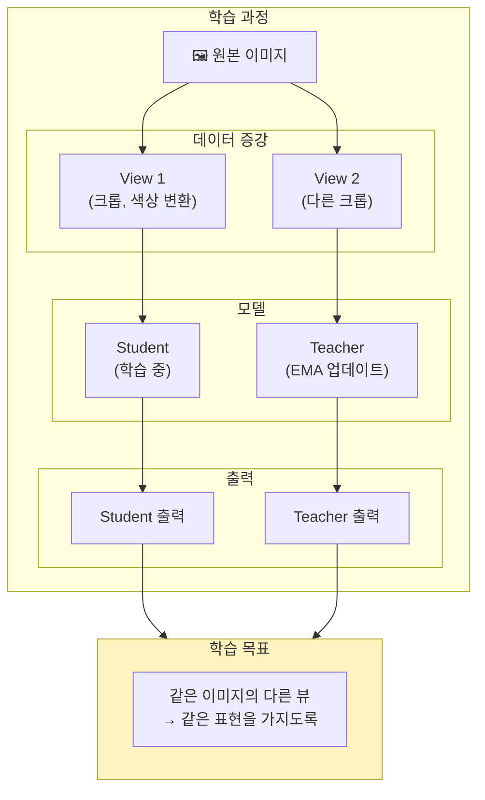

**장점:**
- ✅ 텍스트 데이터 불필요
- ✅ Dense features (픽셀 수준 정보 보존)
- ✅ 세그멘테이션, 깊이 추정에 강함

**단점:**
- ❌ Zero-shot 분류 어려움
- ❌ VLM에서 추가 정렬 학습 필요
- ❌ 텍스트와 직접 연결 안 됨

---

## 📐 토큰 수와 메모리 영향

Vision Encoder의 출력 토큰 수는 GPU 메모리 사용량에 직접적인 영향을 미칩니다.

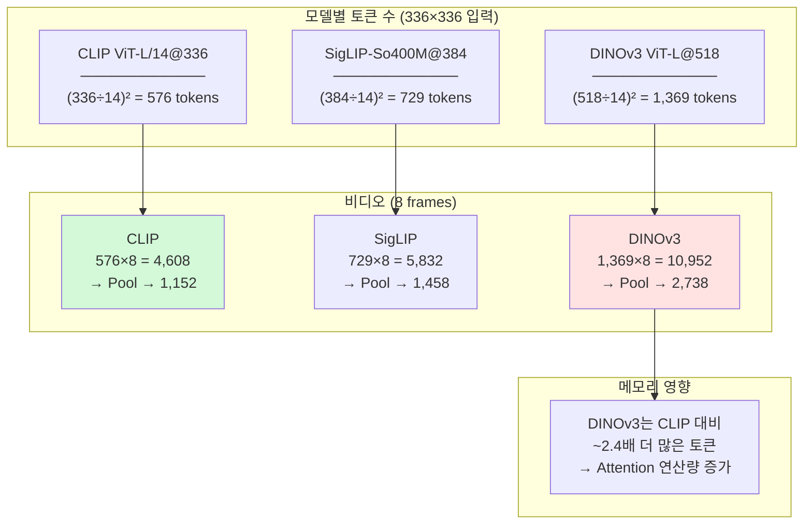

### 메모리 사용량 비교 (7B LLM 기준)

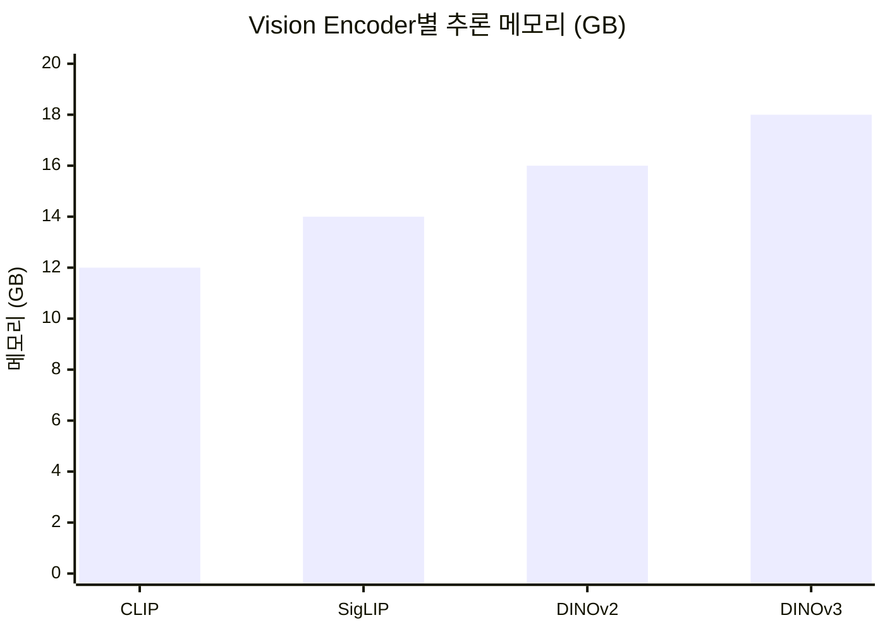

---

## 📊 상세 비교표

| 특성 | CLIP | SigLIP | DINOv2 | DINOv3 |
|------|------|--------|--------|--------|
| **학습 방식** | Contrastive | Sigmoid CE | Self-distill | Gram Anchor |
| **학습 데이터** | 4억 쌍 | 10억+ 쌍 | 1.4억 이미지 | 16.8억 이미지 |
| **텍스트 정렬** | ✅ 강함 | ✅ 강함 | ❌ 약함 | ❌ 약함 |
| **Dense features** | ⚠️ 약함 | ⚠️ 보통 | ✅ 강함 | ✅ 매우 강함 |
| **다국어** | ❌ 영어 위주 | ✅ 109개 언어 | N/A | N/A |
| **기본 해상도** | 224/336 | 384 | 518 | 518 |
| **VLM 적용** | 바로 사용 | 바로 사용 | 정렬 필요 | 정렬 필요 |
| **접근성** | ✅ 공개 | ✅ 공개 | ✅ 공개 | ⚠️ **승인 필요** |

---

## 🎯 우리 프로젝트 적용

### 선택 가이드

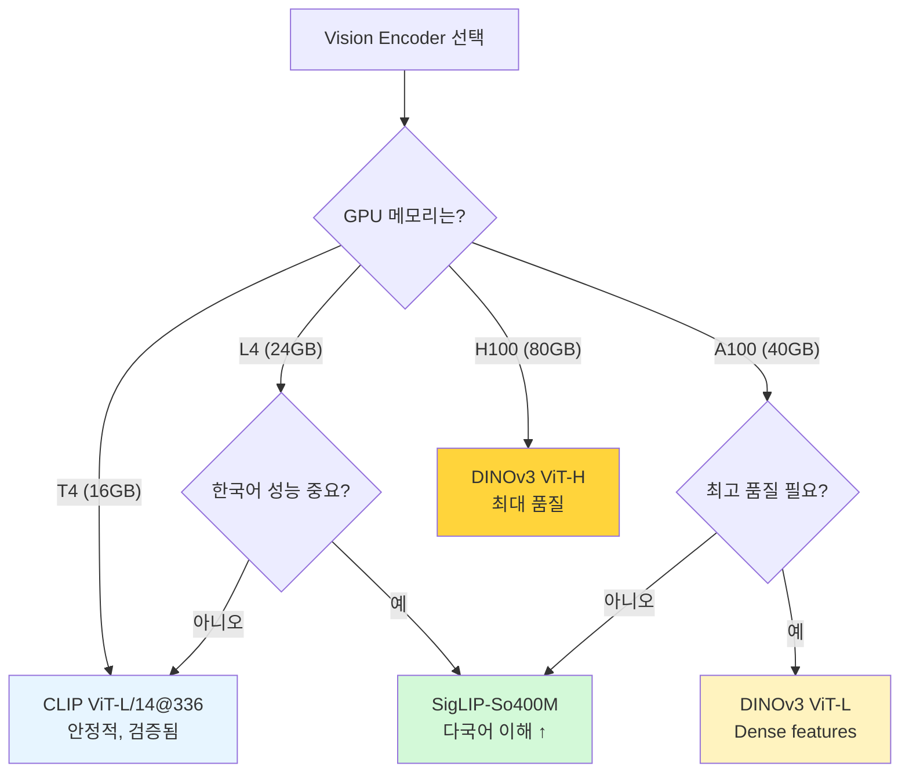

### 기본 선택: CLIP ViT-L/14@336

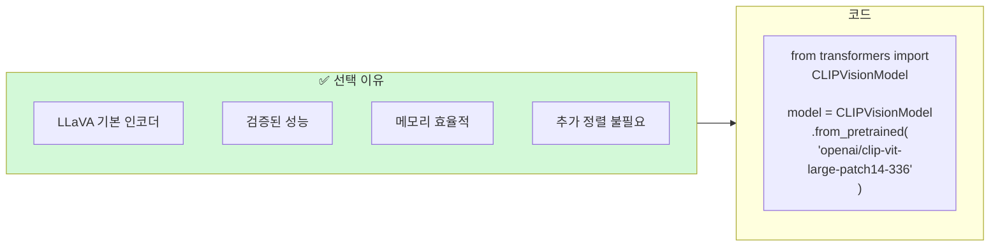

### 업그레이드 옵션 1: SigLIP

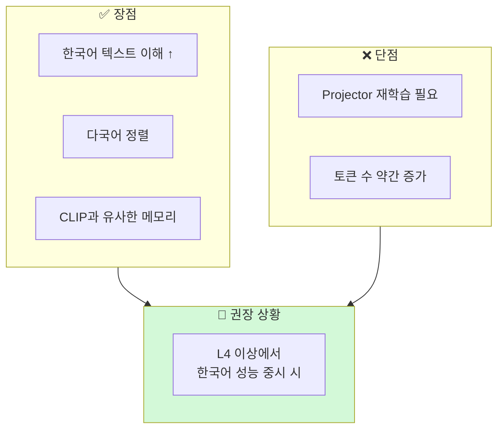

### 업그레이드 옵션 2: DINOv3

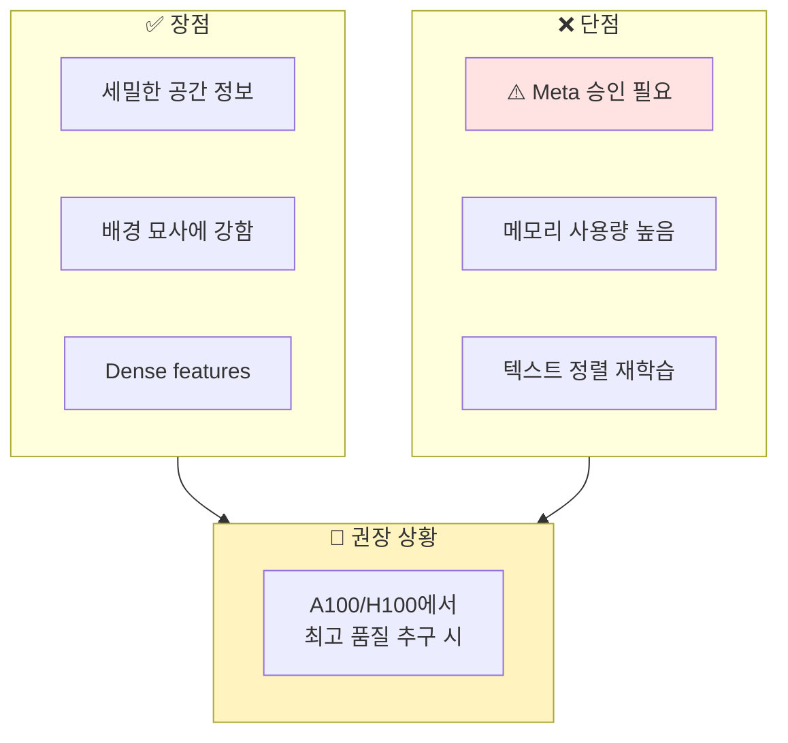

---

## 🔄 Vision Encoder 교체 시 주의사항

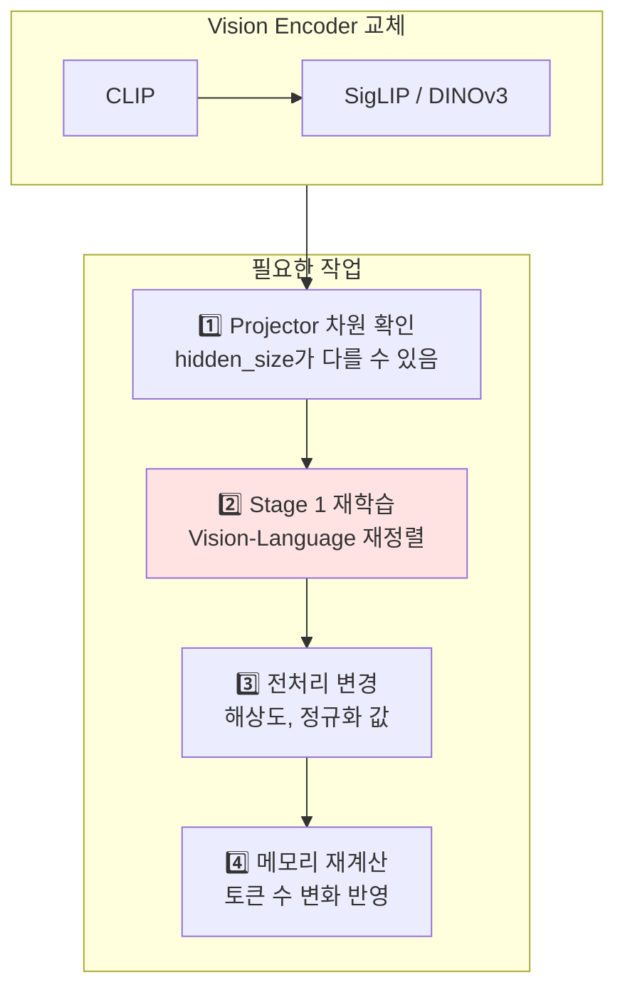

---

## 📚 논문 목록

| 파일 | 논문 | 핵심 포인트 | 중요도 |
|------|------|------------|--------|
| [clip.md](clip.md) | CLIP (2021) | VLM의 표준 Vision Encoder | ⭐⭐⭐⭐⭐ |
| [siglip.md](siglip.md) | SigLIP (2023) | 다국어 + Sigmoid Loss | ⭐⭐⭐⭐ |
| [dinov2.md](dinov2.md) | DINOv2 (2023) | Self-supervised, Dense | ⭐⭐⭐ |
| [dinov3.md](dinov3.md) | DINOv3 (2024) | Gram Anchoring, 최고 품질 | ⭐⭐⭐⭐ |

---

## 💻 GPU별 권장

| GPU | 권장 Vision Encoder | 이유 |
|-----|---------------------|------|
| **T4 (16GB)** | CLIP ViT-L/14@336 | 메모리 제약, 기본 선택 |
| **L4 (24GB)** | SigLIP-So400M@384 | 다국어 이점, 여유 있음 |
| **A100 (40GB)** | DINOv3 ViT-L@518 | Dense features, 고품질 |
| **H100 (80GB)** | DINOv3 ViT-H@518 | 최대 품질 |
