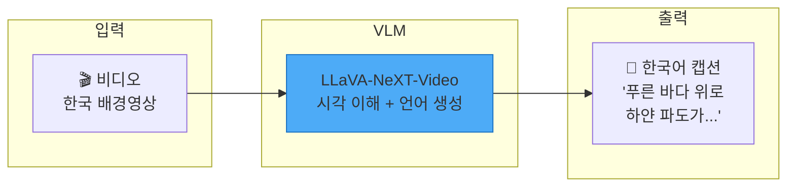
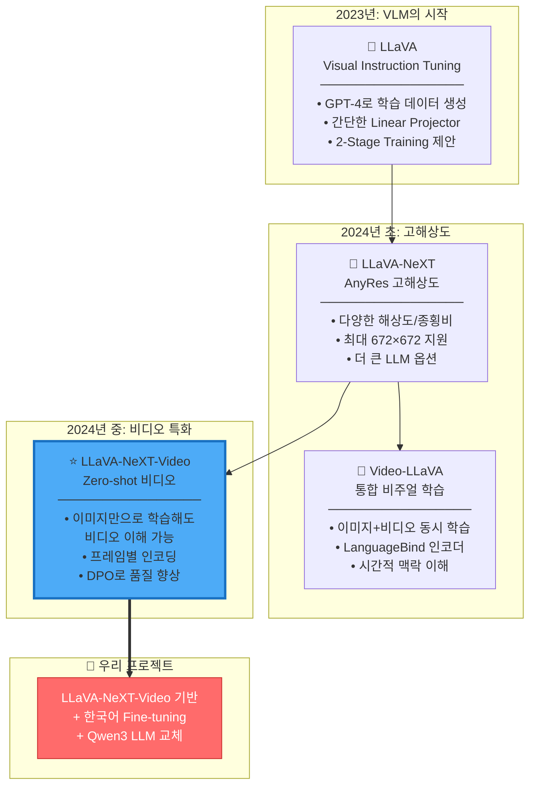
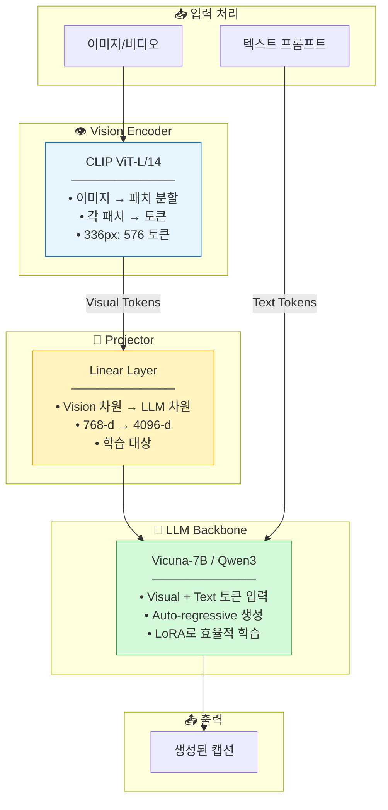
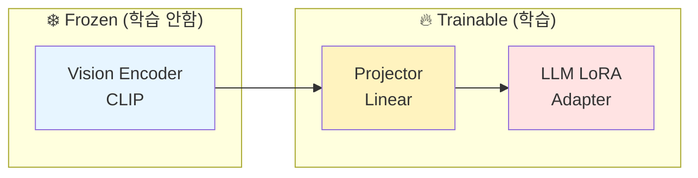
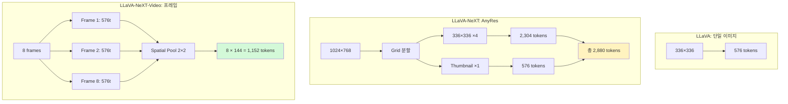
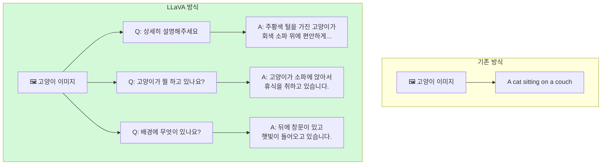
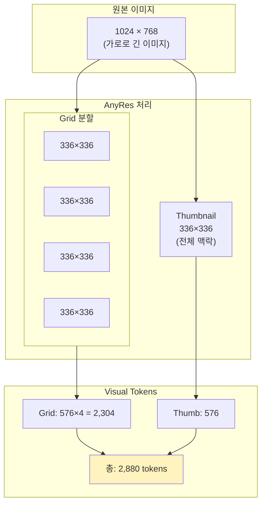
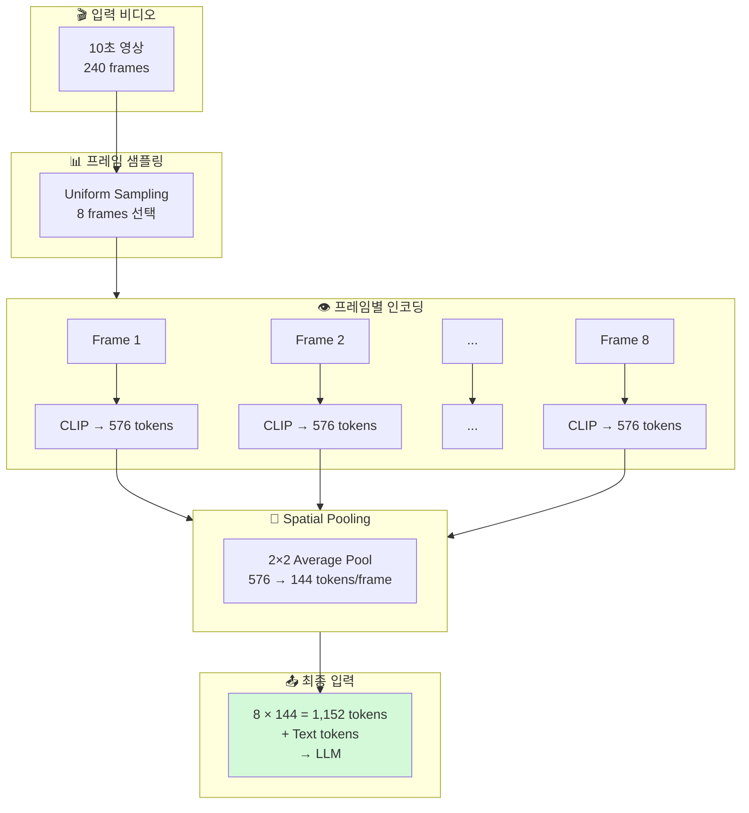
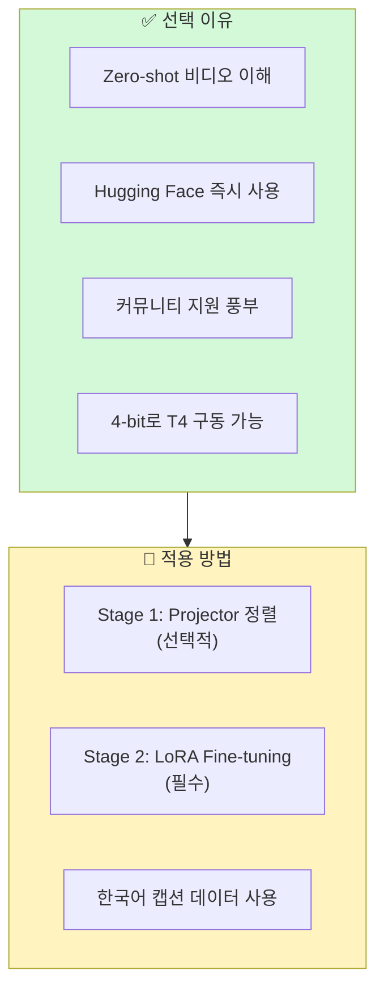
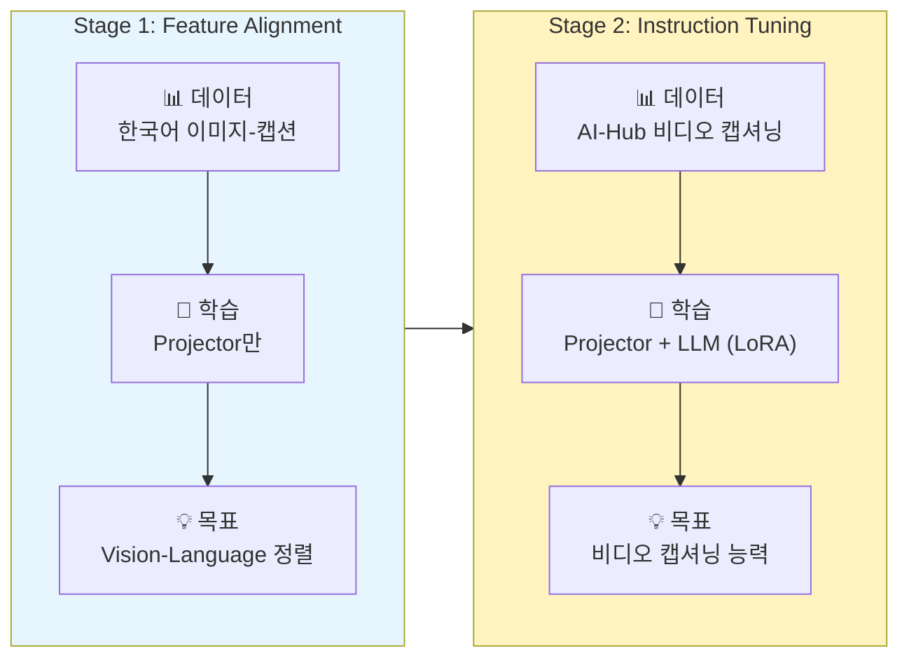

# VLM Core - Vision-Language Model 핵심

> 💡 **핵심 질문**: 이미지/비디오를 어떻게 이해하고 자연어로 설명할 것인가?

Vision-Language Model의 발전 흐름과 핵심 논문들을 정리합니다.

---

## 🎯 이 카테고리의 목표

VLM은 **시각 정보**를 **자연어**로 변환하는 모델입니다. 우리 프로젝트에서는 비디오를 입력받아 한국어 캡션을 생성해야 합니다.



---

## 📊 VLM 발전 흐름



---

## 🏗️ VLM 아키텍처 상세

### 공통 구조

모든 LLaVA 계열 모델은 동일한 기본 구조를 공유합니다:



### 학습 시 각 컴포넌트 역할



---

## 📐 모델별 상세 비교

### 입력 처리 방식



### 상세 비교표

| 특성 | LLaVA | LLaVA-NeXT | LLaVA-NeXT-Video | Video-LLaVA |
|------|-------|------------|------------------|-------------|
| **입력** | 이미지 | 이미지 (고해상도) | **비디오** ⭐ | 이미지+비디오 |
| **Vision Encoder** | CLIP-L/14 | CLIP-L/14@336 | CLIP-L/14@336 | LanguageBind |
| **해상도** | 224/336 | 최대 672 | 336/frame | 336 |
| **Projector** | Linear | Linear | Linear + Pool | Linear |
| **LLM** | Vicuna-7B | 다양함 | Vicuna-7B | Vicuna-7B |
| **비디오 지원** | ❌ | ❌ | ✅ (zero-shot) | ✅ (native) |
| **메모리 (추론)** | ~14GB | ~16GB | ~14GB | ~14GB |

---

## 🔑 핵심 개념 상세 설명

### 1. Visual Instruction Tuning (LLaVA)

기존의 단순 캡셔닝을 넘어, **다양한 질문**에 답할 수 있도록 학습합니다.



### 2. AnyRes (LLaVA-NeXT)

다양한 해상도와 종횡비를 효율적으로 처리합니다.



### 3. Video Frame Processing (LLaVA-NeXT-Video)

비디오를 프레임 시퀀스로 처리하면서 메모리를 효율적으로 관리합니다.



---

## 🎯 우리 프로젝트 적용

### 선택: LLaVA-NeXT-Video-7B



### 프롬프트 형식

```python
# 기본 프롬프트
prompt = "USER: <video>이 영상을 한국어로 상세히 묘사해주세요. ASSISTANT:"

# 상세 프롬프트 (더 나은 결과)
prompt = """USER: <video>
이 영상에 나타난 장면을 한국어로 상세하게 묘사해주세요.
다음 요소들을 포함해주세요:
- 주요 배경과 환경
- 눈에 띄는 특징
- 전반적인 분위기
ASSISTANT:"""
```

### Fine-tuning 전략



---

## 📚 논문 목록

| 파일 | 논문 | 핵심 포인트 | 중요도 |
|------|------|------------|--------|
| [llava.md](llava.md) | LLaVA (2023) | VLM의 기초, 2-Stage Training | ⭐⭐⭐ |
| [llava_next.md](llava_next.md) | LLaVA-NeXT (2024) | AnyRes, 고해상도 처리 | ⭐⭐ |
| [llava_next_video.md](llava_next_video.md) | LLaVA-NeXT-Video (2024) | **우리 기본 모델** | ⭐⭐⭐⭐⭐ |
| [video_llava.md](video_llava.md) | Video-LLaVA (2024) | 대안 모델, 통합 학습 | ⭐⭐ |

---

## 🔗 추가 참고 자료

- [LLaVA 공식 GitHub](https://github.com/haotian-liu/LLaVA)
- [LLaVA-NeXT Blog](https://llava-vl.github.io/blog/)
- [Hugging Face LLaVA Collection](https://huggingface.co/collections/llava-hf/)
