# LLaVA-NeXT-Video: A Strong Zero-shot Video Understanding Model

> ⭐ **우리 프로젝트의 기본 모델**: 이미지 학습만으로 비디오를 이해하는 Zero-shot 능력

- **저자**: Haotian Liu et al.
- **기관**: ByteDance, University of Wisconsin-Madison
- **연도**: 2024
- **링크**: [Blog](https://llava-vl.github.io/blog/2024-04-30-llava-next-video/)

---

## 💡 핵심 기여

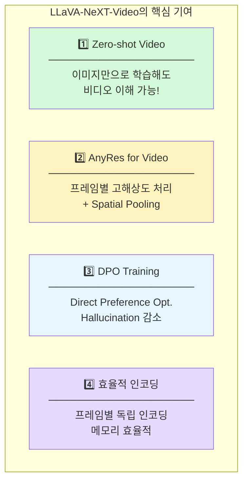

---

## 아키텍처


### 전체 구조

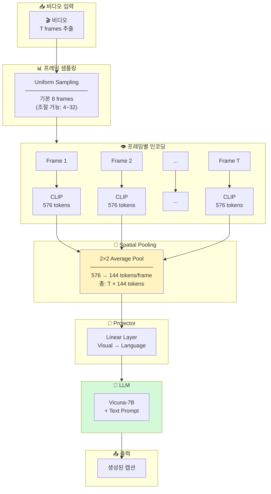

### 토큰 수 계산

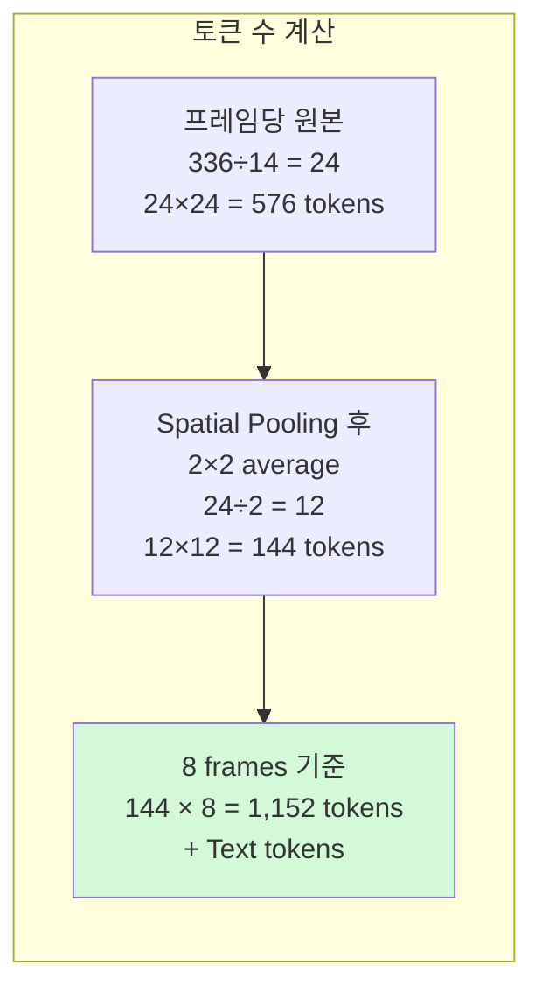

---

## 📊 Zero-shot Video Understanding

### 왜 가능한가?

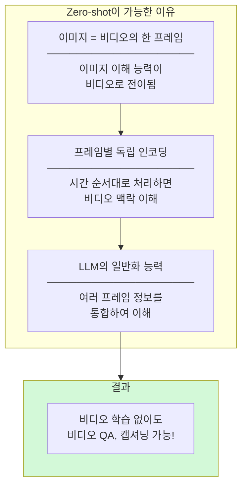

### 한계점

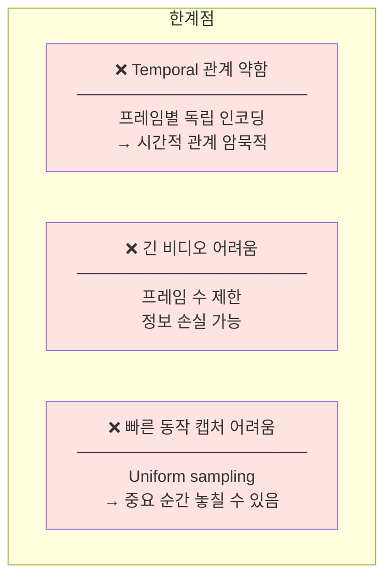

---

## 🎓 학습 전략

### Stage 1: Image Pre-training

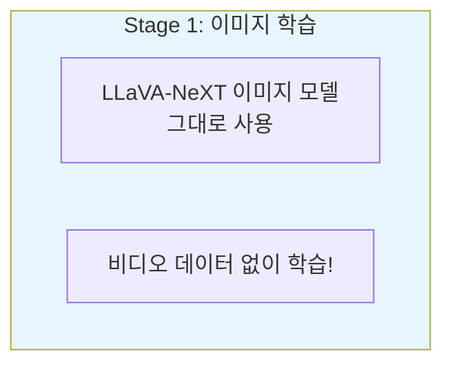

### Stage 2: Video Fine-tuning (Optional)

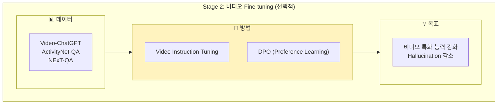

### DPO (Direct Preference Optimization)

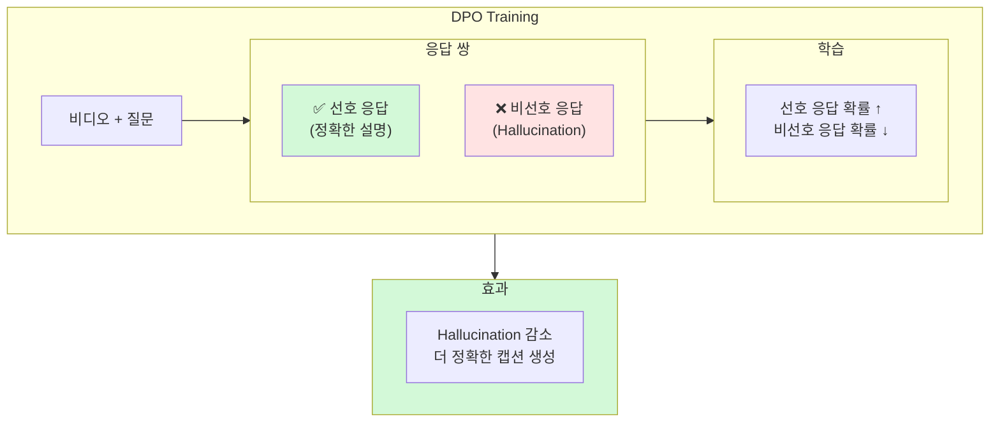

---

## 🎯 우리 프로젝트 적용

### 프레임 수 설정

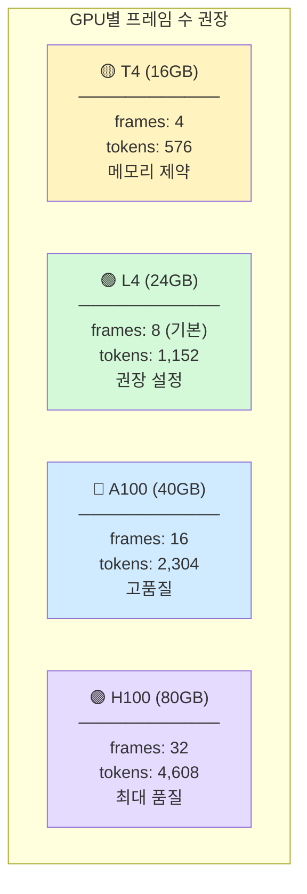

### 코드 예시

```python
from transformers import LlavaNextVideoForConditionalGeneration, LlavaNextVideoProcessor

# 모델 로드
model_id = "llava-hf/LLaVA-NeXT-Video-7B-hf"
processor = LlavaNextVideoProcessor.from_pretrained(model_id)
model = LlavaNextVideoForConditionalGeneration.from_pretrained(
    model_id,
    torch_dtype=torch.float16,
    device_map="auto",
)

# 비디오 프레임 준비 (PIL Images 리스트)
frames = extract_frames(video_path, num_frames=8)

# 프롬프트
prompt = "USER: <video>이 영상을 한국어로 상세히 묘사해주세요. ASSISTANT:"

# 추론
inputs = processor(text=prompt, videos=frames, return_tensors="pt").to(model.device)
outputs = model.generate(**inputs, max_new_tokens=256)
caption = processor.decode(outputs[0], skip_special_tokens=True)
```

### Fine-tuning 전략

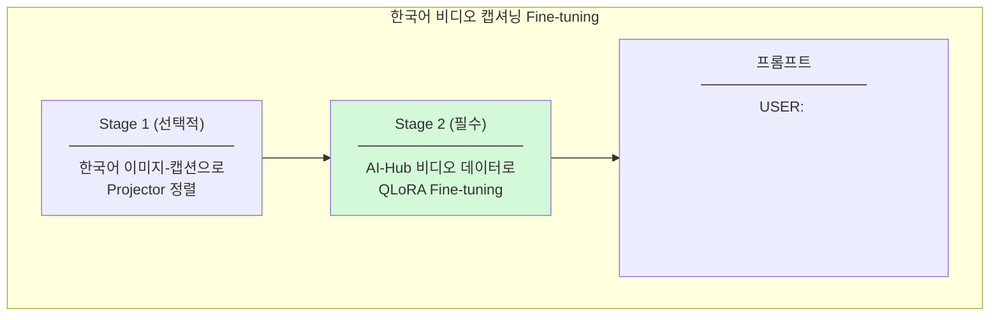

---

## 📈 성능 (Zero-shot)

| Benchmark | LLaVA-NeXT-Video-7B | LLaVA-NeXT-Video-7B-DPO |
|-----------|---------------------|------------------------|
| **ActivityNet-QA** | 53.5 | **56.2** |
| **MSVD-QA** | 67.8 | **70.1** |
| **MSRVTT-QA** | 53.2 | **55.8** |
| **TGIF-QA** | 67.1 | **69.3** |

---

## ⚠️ 구현 시 주의점

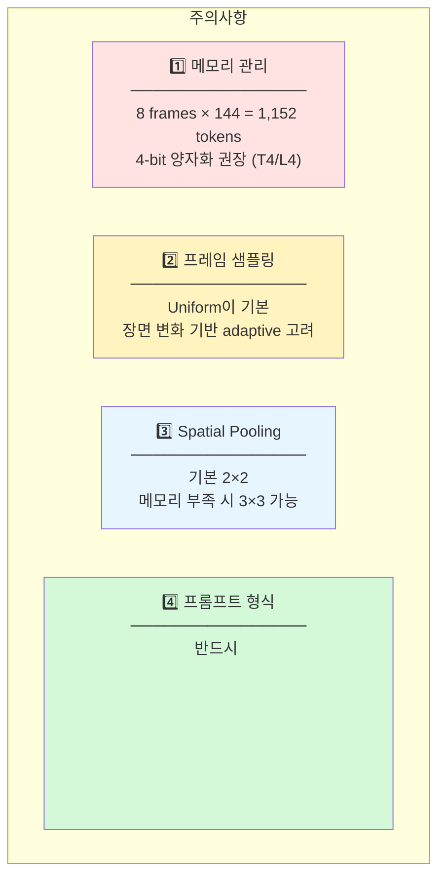

---

## 🔗 관련 리소스

- **Hugging Face**: 
  - `llava-hf/LLaVA-NeXT-Video-7B-hf`
  - `llava-hf/LLaVA-NeXT-Video-7B-DPO-hf` (DPO 적용)
  - `llava-hf/LLaVA-NeXT-Video-34B-hf` (대형 모델)
- **GitHub**: [LLaVA-VL/LLaVA-NeXT](https://github.com/LLaVA-VL/LLaVA-NeXT)
- **Blog**: [llava-vl.github.io](https://llava-vl.github.io/blog/2024-04-30-llava-next-video/)

---

## 📚 인용

```bibtex
@misc{liu2024llavanext,
  title={LLaVA-NeXT: A Strong Zero-shot Video Understanding Model},
  author={Liu, Haotian and others},
  year={2024},
  howpublished={\url{https://llava-vl.github.io/blog/2024-04-30-llava-next-video/}}
}
```
